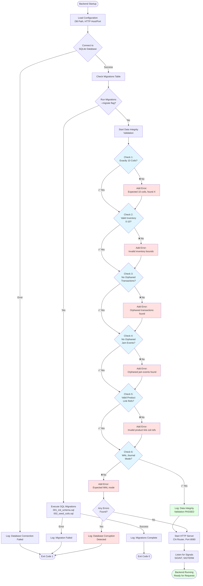
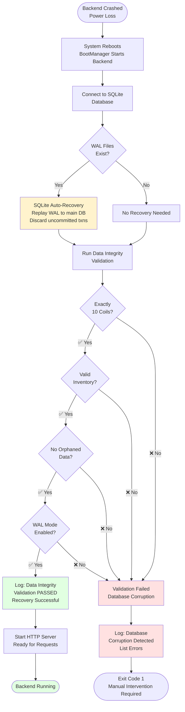

# ZootBox Inventory Tracking System - Complete Flow Chart

**Created**: December 28, 2025
**System**: ZootBox Vending Machine (10 Coils: A1-J1)

---

## Table of Contents

1. [System Architecture Overview](#system-architecture-overview)
2. [Normal Purchase Flow](#normal-purchase-flow)
3. [Admin Restocking Flow](#admin-restocking-flow)
4. [Background Sync Flow](#background-sync-flow)
5. [Portal Monitoring Flow](#portal-monitoring-flow)
6. [Jam Detection & Resolution Flow](#jam-detection--resolution-flow)
7. [Data Consistency Model](#data-consistency-model)

---

## System Architecture Overview

```
┌─────────────────────────────────────────────────────────────────────────┐
│                          ZOOTBOX SYSTEM LAYERS                          │
└─────────────────────────────────────────────────────────────────────────┘

Layer 1: LOCAL ANDROID APP (Primary Source of Truth)
┌───────────────────────────────────────────────────────────────────────┐
│  Android Tablet (On-Device)                                           │
│  ┌─────────────────────────────────────────────────────────────────┐  │
│  │  MyApplication (Android App)                                    │  │
│  │  ┌───────────────────────────────────────────────────────────┐  │  │
│  │  │  Local SQLite Database                                    │  │  │
│  │  │  /data/data/com.example.myapplication/databases/         │  │  │
│  │  │  zootbox_inventory.db                                     │  │  │
│  │  │                                                           │  │  │
│  │  │  ┌─────────────────┐  ┌──────────────────────┐          │  │  │
│  │  │  │  coils          │  │  local_transactions  │          │  │  │
│  │  │  ├─────────────────┤  ├──────────────────────┤          │  │  │
│  │  │  │ A1: inv=10     │  │ txn_001: A1, success│          │  │  │
│  │  │  │ B1: inv=8      │  │ txn_002: B1, success│          │  │  │
│  │  │  │ C1: inv=10     │  │ txn_003: B1, jam    │          │  │  │
│  │  │  │ ... (10 rows)  │  │ ... (history)       │          │  │  │
│  │  │  └─────────────────┘  └──────────────────────┘          │  │  │
│  │  │                                                           │  │  │
│  │  │  ✅ Works 100% OFFLINE                                   │  │  │
│  │  │  ✅ Primary source of truth                              │  │  │
│  │  │  ✅ Inventory decrements happen HERE                     │  │  │
│  │  └───────────────────────────────────────────────────────────┘  │  │
│  └─────────────────────────────────────────────────────────────────┘  │
└───────────────────────────────────────────────────────────────────────┘
                                    │
                                    │ HTTP Sync (every 1 hour)
                                    ▼
Layer 2: BACKEND API (Sync & Mirror)
┌───────────────────────────────────────────────────────────────────────┐
│  Android Tablet (Termux)                                              │
│  ┌─────────────────────────────────────────────────────────────────┐  │
│  │  Go Backend Service (zootbox-backend)                          │  │
│  │  Port: 8080, Host: 0.0.0.0                                     │  │
│  │  ┌───────────────────────────────────────────────────────────┐  │  │
│  │  │  SQLite Database (Mirror of Android)                     │  │  │
│  │  │  /data/data/com.termux/files/home/zootbox/data/          │  │  │
│  │  │  inventory.db                                             │  │  │
│  │  │                                                           │  │  │
│  │  │  ┌─────────────────┐  ┌──────────────────────┐          │  │  │
│  │  │  │  coils          │  │  transactions        │          │  │  │
│  │  │  ├─────────────────┤  ├──────────────────────┤          │  │  │
│  │  │  │ A1: inv=10     │  │ txn_001: A1, success│          │  │  │
│  │  │  │ B1: inv=8      │  │ txn_002: B1, success│          │  │  │
│  │  │  │ C1: inv=10     │  │ txn_003: B1, jam    │          │  │  │
│  │  │  │ ... (10 rows)  │  │ ... (synced)        │          │  │  │
│  │  │  └─────────────────┘  └──────────────────────┘          │  │  │
│  │  │                                                           │  │  │
│  │  │  ✅ Receives hourly updates from Android                 │  │  │
│  │  │  ✅ Serves portal API requests                           │  │  │
│  │  │  ✅ Can trigger refills (writes back to Android DB)      │  │  │
│  │  └───────────────────────────────────────────────────────────┘  │  │
│  └─────────────────────────────────────────────────────────────────┘  │
└───────────────────────────────────────────────────────────────────────┘
                                    │
                                    │ HTTP API (Tailscale VPN)
                                    ▼
Layer 3: WEB PORTAL (Remote Monitoring)
┌───────────────────────────────────────────────────────────────────────┐
│  Operator's Windows PC (Remote Location)                              │
│  ┌─────────────────────────────────────────────────────────────────┐  │
│  │  Web Browser (Chrome/Edge)                                     │  │
│  │  http://localhost:3000                                         │  │
│  │  ┌───────────────────────────────────────────────────────────┐  │  │
│  │  │  Inventory Portal (JavaScript SPA)                       │  │  │
│  │  │                                                           │  │  │
│  │  │  ┌─────────────────────────────────────────────────────┐  │  │  │
│  │  │  │  Coil Grid Display (10 rows)                       │  │  │  │
│  │  │  │  ┌───────┬───────┬───────┬─────────┐              │  │  │  │
│  │  │  │  │ Coil  │ Inv   │ Status│ Action  │              │  │  │  │
│  │  │  │  ├───────┼───────┼───────┼─────────┤              │  │  │  │
│  │  │  │  │ A1    │ 10/10 │ 🟢    │ [Edit]  │              │  │  │  │
│  │  │  │  │ B1    │  8/10 │ 🟢    │ [Edit]  │              │  │  │  │
│  │  │  │  │ C1    │  2/10 │ 🟠    │ [Edit]  │              │  │  │  │
│  │  │  │  │ D1    │  0/10 │ ⚪    │ [Edit]  │              │  │  │  │
│  │  │  │  │ ... (10 rows total)              │              │  │  │  │
│  │  │  │  └──────────────────────────────────┘              │  │  │  │
│  │  │  │                                                     │  │  │  │
│  │  │  │  [Refill All to 10] [Manual Entry]                │  │  │  │
│  │  │  └─────────────────────────────────────────────────────┘  │  │  │
│  │  │                                                           │  │  │
│  │  │  ✅ Real-time monitoring (5-second refresh)              │  │  │
│  │  │  ✅ Bulk refill operations                               │  │  │
│  │  │  ✅ Manual inventory adjustments                         │  │  │
│  │  └───────────────────────────────────────────────────────────┘  │  │
│  └─────────────────────────────────────────────────────────────────┘  │
└───────────────────────────────────────────────────────────────────────┘
```

---

## Normal Purchase Flow

### Step-by-Step: Customer Buys a Product

```
START: Customer at Vending Machine
│
▼
┌─────────────────────────────────────────────────────────────┐
│ STEP 1: Customer Interaction                                │
│ ┌─────────────────────────────────────────────────────────┐ │
│ │ Customer approaches machine                             │ │
│ │ Taps product on screen (e.g., "Marlboro Red")          │ │
│ └─────────────────────────────────────────────────────────┘ │
└─────────────────────────────────────────────────────────────┘
│
▼
┌─────────────────────────────────────────────────────────────┐
│ STEP 2: Android App - Product Selection                    │
│ ┌─────────────────────────────────────────────────────────┐ │
│ │ MainActivity → ProductGridActivity                      │ │
│ │ User taps "Marlboro Red" product card                   │ │
│ │ Navigation to ProductDetailActivity                     │ │
│ └─────────────────────────────────────────────────────────┘ │
└─────────────────────────────────────────────────────────────┘
│
▼
┌─────────────────────────────────────────────────────────────┐
│ STEP 3: Determine Coil & Check Inventory                   │
│ ┌─────────────────────────────────────────────────────────┐ │
│ │ ProductDetailActivity.determineCoilForProduct()         │ │
│ │                                                         │ │
│ │ val coilId = "B1"  // Hash-based mapping              │ │
│ │                                                         │ │
│ │ // Query local database                                │ │
│ │ val coil = inventoryRepo.getCoil("B1")                 │ │
│ │ // Returns: Coil(id="B1", inventory=8, status="avail") │ │
│ │                                                         │ │
│ │ if (coil.inventory == 0) {                             │ │
│ │   ❌ Show "OUT OF STOCK" banner                        │ │
│ │   ❌ Disable purchase button                           │ │
│ │   STOP                                                  │ │
│ │ }                                                       │ │
│ │                                                         │ │
│ │ if (coil.isJammed()) {                                 │ │
│ │   ❌ Show "TEMPORARILY UNAVAILABLE" banner             │ │
│ │   ❌ Disable purchase button                           │ │
│ │   STOP                                                  │ │
│ │ }                                                       │ │
│ │                                                         │ │
│ │ ✅ Inventory OK (8 units available)                    │ │
│ │ ✅ Enable "Purchase" button                            │ │
│ └─────────────────────────────────────────────────────────┘ │
└─────────────────────────────────────────────────────────────┘
│
▼
┌─────────────────────────────────────────────────────────────┐
│ STEP 4: Age Verification                                    │
│ ┌─────────────────────────────────────────────────────────┐ │
│ │ User clicks "Purchase" button                           │ │
│ │ Navigation to IdScanActivity                            │ │
│ │                                                         │ │
│ │ User scans driver's license on ID scanner              │ │
│ │ IdScannerManager reads AAMVA data                       │ │
│ │ AamvaFieldParser extracts birthdate                     │ │
│ │                                                         │ │
│ │ if (age < 21) {                                        │ │
│ │   ❌ Show "Age verification failed"                    │ │
│ │   STOP (return to product screen)                      │ │
│ │ }                                                       │ │
│ │                                                         │ │
│ │ ✅ Age verified (21+)                                  │ │
│ │ Return to ProductDetailActivity with SUCCESS           │ │
│ └─────────────────────────────────────────────────────────┘ │
└─────────────────────────────────────────────────────────────┘
│
▼
┌─────────────────────────────────────────────────────────────┐
│ STEP 5: Process Checkout & Decrement Inventory             │
│ ┌─────────────────────────────────────────────────────────┐ │
│ │ ProductDetailActivity.processCheckout()                 │ │
│ │                                                         │ │
│ │ // Decrement inventory in local database               │ │
│ │ inventoryRepo.decrementInventory("B1")                  │ │
│ │   ├─> BEGIN TRANSACTION                                │ │
│ │   ├─> UPDATE coils SET inventory = inventory - 1       │ │
│ │   │   WHERE id = 'B1'                                  │ │
│ │   ├─> Inventory: 8 → 7                                │ │
│ │   └─> COMMIT                                           │ │
│ │                                                         │ │
│ │ // Log transaction                                      │ │
│ │ inventoryRepo.logTransaction(                           │ │
│ │   coilId = "B1",                                       │ │
│ │   status = "success",                                  │ │
│ │   timestamp = now()                                    │ │
│ │ )                                                       │ │
│ │   ├─> INSERT INTO local_transactions                   │ │
│ │   ├─> id = "txn_12345"                                │ │
│ │   ├─> coil_id = "B1"                                  │ │
│ │   ├─> status = "success"                              │ │
│ │   ├─> synced = 0  (not yet synced to backend)        │ │
│ │   └─> COMMIT                                           │ │
│ │                                                         │ │
│ │ ✅ Inventory updated locally                           │ │
│ │ ✅ Transaction logged                                  │ │
│ └─────────────────────────────────────────────────────────┘ │
└─────────────────────────────────────────────────────────────┘
│
▼
┌─────────────────────────────────────────────────────────────┐
│ STEP 6: Physical Vending (Hardware)                         │
│ ┌─────────────────────────────────────────────────────────┐ │
│ │ HardwareService.dispenseProduct("B1")                   │ │
│ │                                                         │ │
│ │ // Send command to DMVI motor controller               │ │
│ │ wallCoilMachineService.vend("B1")                       │ │
│ │   ├─> Serial command: "VEND B1\r\n"                   │ │
│ │   ├─> Motor B spins                                    │ │
│ │   └─> Product dispensed                                │ │
│ │                                                         │ │
│ │ ✅ Customer receives product                           │ │
│ └─────────────────────────────────────────────────────────┘ │
└─────────────────────────────────────────────────────────────┘
│
▼
┌─────────────────────────────────────────────────────────────┐
│ STEP 7: UI Update                                           │
│ ┌─────────────────────────────────────────────────────────┐ │
│ │ ProductDetailActivity.checkInventoryAndUpdateUI()       │ │
│ │                                                         │ │
│ │ val updatedCoil = inventoryRepo.getCoil("B1")          │ │
│ │ // Returns: Coil(id="B1", inventory=7, ...)            │ │
│ │                                                         │ │
│ │ if (updatedCoil.inventory == 0) {                      │ │
│ │   ❌ Show "OUT OF STOCK" banner                        │ │
│ │   ❌ Disable purchase button                           │ │
│ │ } else {                                                │ │
│ │   ✅ Show updated inventory: "7 units remaining"       │ │
│ │ }                                                       │ │
│ │                                                         │ │
│ │ Toast: "Purchase successful! Total: $24.99"            │ │
│ └─────────────────────────────────────────────────────────┘ │
└─────────────────────────────────────────────────────────────┘
│
▼
END: Purchase Complete
┌─────────────────────────────────────────────────────────────┐
│ RESULT:                                                      │
│ ✅ Customer has product                                     │
│ ✅ Local DB inventory: B1 = 7 (decremented)                │
│ ✅ Transaction logged in local DB                          │
│ ⏳ Backend DB: B1 = 8 (not yet synced, will sync in <1hr) │
│ ⏳ Portal: Shows B1 = 8 (will update after next sync)      │
└─────────────────────────────────────────────────────────────┘
```

---

## Admin Restocking Flow

### Step-by-Step: Operator Refills Machine

```
START: Operator Restocks Machine
│
▼
┌─────────────────────────────────────────────────────────────┐
│ STEP 1: Access Admin Panel                                  │
│ ┌─────────────────────────────────────────────────────────┐ │
│ │ Operator at tablet                                      │ │
│ │ MainActivity is open                                    │ │
│ │                                                         │ │
│ │ Long-press on orb icon (3 seconds)                     │ │
│ │   ├─> Haptic feedback (vibration)                      │ │
│ │   ├─> Toast: "Admin Mode"                              │ │
│ │   └─> Navigation to AdminPanelActivity                 │ │
│ └─────────────────────────────────────────────────────────┘ │
└─────────────────────────────────────────────────────────────┘
│
▼
┌─────────────────────────────────────────────────────────────┐
│ STEP 2: PIN Authentication                                  │
│ ┌─────────────────────────────────────────────────────────┐ │
│ │ AdminPanelActivity displays PIN entry                   │ │
│ │                                                         │ │
│ │ Operator enters PIN: "1234"                            │ │
│ │                                                         │ │
│ │ // Verify PIN                                           │ │
│ │ val storedHash = sharedPrefs.getString("admin_pin")    │ │
│ │ val enteredHash = sha256("1234")                       │ │
│ │                                                         │ │
│ │ if (enteredHash != storedHash) {                       │ │
│ │   ❌ failedAttempts++                                  │ │
│ │   ❌ Shake animation                                   │ │
│ │   if (failedAttempts >= 3) {                           │ │
│ │     ❌ 30-second lockout                               │ │
│ │     STOP                                                │ │
│ │   }                                                     │ │
│ │   RETRY                                                 │ │
│ │ }                                                       │ │
│ │                                                         │ │
│ │ ✅ PIN correct, show admin panel                       │ │
│ └─────────────────────────────────────────────────────────┘ │
└─────────────────────────────────────────────────────────────┘
│
▼
┌─────────────────────────────────────────────────────────────┐
│ STEP 3: View Current Inventory                              │
│ ┌─────────────────────────────────────────────────────────┐ │
│ │ AdminPanelActivity loads inventory                      │ │
│ │                                                         │ │
│ │ val coils = inventoryRepo.getAllCoils()                │ │
│ │                                                         │ │
│ │ Display:                                                │ │
│ │ ┌─────┬──────────┬─────────┬────────┐                 │ │
│ │ │ Row │ Inventory│ Progress│ Status │                 │ │
│ │ ├─────┼──────────┼─────────┼────────┤                 │ │
│ │ │ A1  │ 10/10    │ ██████  │ 🟢     │                 │ │
│ │ │ B1  │  7/10    │ ████░░  │ 🟢     │                 │ │
│ │ │ C1  │  2/10    │ █░░░░░  │ 🟠 LOW │                 │ │
│ │ │ D1  │  0/10    │ ░░░░░░  │ ⚪ EMPTY│                 │ │
│ │ │ ... │ ...      │ ...     │ ...    │                 │ │
│ │ └─────┴──────────┴─────────┴────────┘                 │ │
│ │                                                         │ │
│ │ Total: 47/100 units                                    │ │
│ │                                                         │ │
│ │ [Fill All to 10] [Manual Entry] [View Stats]          │ │
│ └─────────────────────────────────────────────────────────┘ │
└─────────────────────────────────────────────────────────────┘
│
▼
┌─────────────────────────────────────────────────────────────┐
│ OPTION A: Bulk Refill                                       │
│ ┌─────────────────────────────────────────────────────────┐ │
│ │ Operator taps "Fill All to 10"                          │ │
│ │                                                         │ │
│ │ // Show confirmation dialog                             │ │
│ │ Dialog: "Set all 10 coils to inventory=10?"            │ │
│ │         "Current total: 47 units"                      │ │
│ │         [Cancel] [Confirm]                             │ │
│ │                                                         │ │
│ │ Operator taps [Confirm]                                │ │
│ │                                                         │ │
│ │ inventoryRepo.resetAllInventory(10)                     │ │
│ │   ├─> BEGIN TRANSACTION                                │ │
│ │   ├─> UPDATE coils SET inventory = 10                  │ │
│ │   ├─> 10 rows updated                                  │ │
│ │   └─> COMMIT                                           │ │
│ │                                                         │ │
│ │ ✅ Toast: "Filled 10 coils to 10 units"               │ │
│ │ ✅ UI refreshes, all rows show 10/10                  │ │
│ └─────────────────────────────────────────────────────────┘ │
└─────────────────────────────────────────────────────────────┘
│
│
▼
┌─────────────────────────────────────────────────────────────┐
│ OPTION B: Manual Entry                                      │
│ ┌─────────────────────────────────────────────────────────┐ │
│ │ Operator taps "Manual Entry"                            │ │
│ │                                                         │ │
│ │ // Show manual entry dialog                             │ │
│ │ Dialog with number pickers (0-10) for each row:        │ │
│ │ ┌─────┬───────────────────┐                            │ │
│ │ │ A1  │ [▼] 10 [▲]       │                            │ │
│ │ │ B1  │ [▼]  7 [▲]       │ ← Can adjust individually  │ │
│ │ │ C1  │ [▼]  5 [▲]       │ ← Changed from 2 to 5      │ │
│ │ │ D1  │ [▼]  3 [▲]       │ ← Changed from 0 to 3      │ │
│ │ │ ... │ ...               │                            │ │
│ │ └─────┴───────────────────┘                            │ │
│ │ [Cancel] [Save Changes]                                │ │
│ │                                                         │ │
│ │ Operator adjusts values, taps [Save Changes]           │ │
│ │                                                         │ │
│ │ // Update each modified coil                            │ │
│ │ inventoryRepo.updateInventory("C1", 5)                  │ │
│ │ inventoryRepo.updateInventory("D1", 3)                  │ │
│ │   ├─> BEGIN TRANSACTION                                │ │
│ │   ├─> UPDATE coils SET inventory = 5 WHERE id = 'C1'  │ │
│ │   ├─> UPDATE coils SET inventory = 3 WHERE id = 'D1'  │ │
│ │   └─> COMMIT                                           │ │
│ │                                                         │ │
│ │ ✅ Toast: "Inventory updated"                          │ │
│ │ ✅ UI refreshes with new values                        │ │
│ └─────────────────────────────────────────────────────────┘ │
└─────────────────────────────────────────────────────────────┘
│
▼
END: Restocking Complete
┌─────────────────────────────────────────────────────────────┐
│ RESULT:                                                      │
│ ✅ Local DB updated with new inventory                     │
│ ✅ Android UI reflects new values immediately              │
│ ⏳ Backend DB: Not yet synced (will sync in <1hr)         │
│ ⏳ Portal: Will show updated values after next sync        │
└─────────────────────────────────────────────────────────────┘
```

---

## Background Sync Flow

### Step-by-Step: Android App Syncs to Backend

```
┌─────────────────────────────────────────────────────────────┐
│ AUTOMATIC SYNC (Every 1 Hour)                               │
└─────────────────────────────────────────────────────────────┘

TRIGGER: WorkManager schedules BackgroundSyncService
│
▼
┌─────────────────────────────────────────────────────────────┐
│ STEP 1: WorkManager Triggers Sync                           │
│ ┌─────────────────────────────────────────────────────────┐ │
│ │ BackgroundSyncService.doWork()                          │ │
│ │                                                         │ │
│ │ // Check network connectivity                           │ │
│ │ if (!isNetworkAvailable()) {                           │ │
│ │   ❌ Log: "No network, skipping sync"                  │ │
│ │   ⏰ Retry in 15 minutes (exponential backoff)         │ │
│ │   STOP                                                  │ │
│ │ }                                                       │ │
│ │                                                         │ │
│ │ ✅ Network available, proceed with sync                │ │
│ └─────────────────────────────────────────────────────────┘ │
└─────────────────────────────────────────────────────────────┘
│
▼
┌─────────────────────────────────────────────────────────────┐
│ STEP 2: Query Local Database                                │
│ ┌─────────────────────────────────────────────────────────┐ │
│ │ // Get all coils                                        │ │
│ │ val coils = inventoryRepo.getAllCoils()                │ │
│ │ // Returns:                                             │ │
│ │ [                                                       │ │
│ │   Coil(id="A1", inventory=10, status="available"),     │ │
│ │   Coil(id="B1", inventory=7,  status="available"),     │ │
│ │   Coil(id="C1", inventory=5,  status="available"),     │ │
│ │   ... (10 coils total)                                 │ │
│ │ ]                                                       │ │
│ │                                                         │ │
│ │ // Get unsynced transactions                            │ │
│ │ val transactions = inventoryRepo.getUnsyncedTransactions()│
│ │ // Returns: All transactions where synced = 0          │ │
│ │ [                                                       │ │
│ │   Transaction(id="txn_12345", coil="B1", status="success"),│
│ │   Transaction(id="txn_12346", coil="C1", status="success"),│
│ │   ... (new transactions since last sync)               │ │
│ │ ]                                                       │ │
│ └─────────────────────────────────────────────────────────┘ │
└─────────────────────────────────────────────────────────────┘
│
▼
┌─────────────────────────────────────────────────────────────┐
│ STEP 3: Build Sync Payload                                  │
│ ┌─────────────────────────────────────────────────────────┐ │
│ │ val syncPayload = buildSyncPayload(coils, transactions)│ │
│ │                                                         │ │
│ │ JSON Payload:                                           │ │
│ │ {                                                       │ │
│ │   "source": "android",                                 │ │
│ │   "timestamp": 1735437600,                             │ │
│ │   "coils": [                                           │ │
│ │     {                                                   │ │
│ │       "id": "A1",                                      │ │
│ │       "inventory": 10,                                 │ │
│ │       "status": "available",                           │ │
│ │       "updated_at": 1735437500                         │ │
│ │     },                                                  │ │
│ │     {                                                   │ │
│ │       "id": "B1",                                      │ │
│ │       "inventory": 7,                                  │ │
│ │       "status": "available",                           │ │
│ │       "updated_at": 1735437550                         │ │
│ │     },                                                  │ │
│ │     ... (8 more coils)                                 │ │
│ │   ],                                                    │ │
│ │   "transactions": [                                    │ │
│ │     {                                                   │ │
│ │       "id": "txn_12345",                               │ │
│ │       "coil_id": "B1",                                 │ │
│ │       "status": "success",                             │ │
│ │       "timestamp": 1735437550                          │ │
│ │     },                                                  │ │
│ │     ... (more transactions)                            │ │
│ │   ]                                                     │ │
│ │ }                                                       │ │
│ └─────────────────────────────────────────────────────────┘ │
└─────────────────────────────────────────────────────────────┘
│
▼
┌─────────────────────────────────────────────────────────────┐
│ STEP 4: Send HTTP Request to Backend                        │
│ ┌─────────────────────────────────────────────────────────┐ │
│ │ POST http://localhost:8080/api/v1/sync/inventory        │ │
│ │ Content-Type: application/json                          │ │
│ │ Body: <syncPayload>                                     │ │
│ │                                                         │ │
│ │ // HTTP Request                                         │ │
│ │ ┌─────────────────────────────────────────────────────┐ │ │
│ │ │ Android App (port random)                           │ │ │
│ │ │         │                                           │ │ │
│ │ │         │ POST /api/v1/sync/inventory              │ │ │
│ │ │         │ JSON: { coils: [...], transactions: [...]}│ │ │
│ │ │         ▼                                           │ │ │
│ │ │ Backend (port 8080)                                │ │ │
│ │ │   ├─> SyncHandler.SyncInventory()                  │ │ │
│ │ │   ├─> Parse JSON                                   │ │ │
│ │ │   ├─> Validate payload                             │ │ │
│ │ │   └─> Update database                              │ │ │
│ │ └─────────────────────────────────────────────────────┘ │ │
│ └─────────────────────────────────────────────────────────┘ │
└─────────────────────────────────────────────────────────────┘
│
▼
┌─────────────────────────────────────────────────────────────┐
│ STEP 5: Backend Processes Sync                              │
│ ┌─────────────────────────────────────────────────────────┐ │
│ │ Backend: SyncHandler.SyncInventory()                    │ │
│ │                                                         │ │
│ │ BEGIN TRANSACTION                                       │ │
│ │                                                         │ │
│ │ // Update coils                                         │ │
│ │ for each coil in payload.coils:                        │ │
│ │   UPDATE coils                                          │ │
│ │   SET inventory = <value>,                             │ │
│ │       status = <status>,                               │ │
│ │       updated_at = <timestamp>                         │ │
│ │   WHERE id = <coil_id>                                 │ │
│ │                                                         │ │
│ │ // Insert transactions (prevent duplicates)             │ │
│ │ for each txn in payload.transactions:                  │ │
│ │   INSERT OR IGNORE INTO transactions                   │ │
│ │   (id, coil_id, status, timestamp, ...)                │ │
│ │   VALUES (<txn_data>)                                  │ │
│ │                                                         │ │
│ │ COMMIT                                                  │ │
│ │                                                         │ │
│ │ ✅ Database updated                                    │ │
│ │ ✅ 10 coils updated                                    │ │
│ │ ✅ 5 transactions inserted                             │ │
│ └─────────────────────────────────────────────────────────┘ │
└─────────────────────────────────────────────────────────────┘
│
▼
┌─────────────────────────────────────────────────────────────┐
│ STEP 6: Backend Sends Response                              │
│ ┌─────────────────────────────────────────────────────────┐ │
│ │ HTTP 200 OK                                             │ │
│ │ Content-Type: application/json                          │ │
│ │                                                         │ │
│ │ Response:                                               │ │
│ │ {                                                       │ │
│ │   "success": true,                                     │ │
│ │   "coils_updated": 10,                                 │ │
│ │   "transactions_added": 5,                             │ │
│ │   "timestamp": 1735437610                              │ │
│ │ }                                                       │ │
│ └─────────────────────────────────────────────────────────┘ │
└─────────────────────────────────────────────────────────────┘
│
▼
┌─────────────────────────────────────────────────────────────┐
│ STEP 7: Android Marks Transactions as Synced                │
│ ┌─────────────────────────────────────────────────────────┐ │
│ │ BackgroundSyncService receives success response         │ │
│ │                                                         │ │
│ │ // Mark all synced transactions                         │ │
│ │ inventoryRepo.markTransactionsAsSynced(transactionIds)  │ │
│ │   ├─> UPDATE local_transactions                        │ │
│ │   ├─> SET synced = 1                                   │ │
│ │   ├─> WHERE id IN (<synced_transaction_ids>)           │ │
│ │   └─> COMMIT                                           │ │
│ │                                                         │ │
│ │ ✅ Transactions marked as synced                       │ │
│ │ ✅ Won't be sent again in next sync                    │ │
│ │                                                         │ │
│ │ Log: "Sync successful: 10 coils, 5 transactions"       │ │
│ │                                                         │ │
│ │ ⏰ Schedule next sync in 1 hour                        │ │
│ └─────────────────────────────────────────────────────────┘ │
└─────────────────────────────────────────────────────────────┘
│
▼
END: Sync Complete
┌─────────────────────────────────────────────────────────────┐
│ RESULT:                                                      │
│ ✅ Backend DB now mirrors Android local DB                 │
│ ✅ All inventory values synchronized                        │
│ ✅ All transactions logged in backend                      │
│ ✅ Portal will show updated values on next refresh         │
│ ⏰ Next sync in 1 hour                                     │
└─────────────────────────────────────────────────────────────┘
```

---

## Portal Monitoring Flow

### Step-by-Step: Operator Views Inventory Remotely

```
START: Operator Opens Portal
│
▼
┌─────────────────────────────────────────────────────────────┐
│ STEP 1: Open Portal in Browser                              │
│ ┌─────────────────────────────────────────────────────────┐ │
│ │ Operator's PC (Windows, Bradenton)                      │ │
│ │                                                         │ │
│ │ Navigate to: http://localhost:3000                     │ │
│ │ (served by Python HTTP server)                         │ │
│ │                                                         │ │
│ │ Browser loads: portal/index.html                        │ │
│ │ ✅ Page loads (HTML/CSS/JS)                            │ │
│ └─────────────────────────────────────────────────────────┘ │
└─────────────────────────────────────────────────────────────┘
│
▼
┌─────────────────────────────────────────────────────────────┐
│ STEP 2: Load Machine Configuration                          │
│ ┌─────────────────────────────────────────────────────────┐ │
│ │ JavaScript: machines.js                                 │ │
│ │                                                         │ │
│ │ // Load from LocalStorage                               │ │
│ │ const machines = localStorage.getItem('zootbox_machines')│
│ │                                                         │ │
│ │ if (!machines) {                                        │ │
│ │   ❌ Show: "No machines configured"                    │ │
│ │   ❌ Prompt: "Add a machine in Machine Settings"       │ │
│ │   STOP                                                  │ │
│ │ }                                                       │ │
│ │                                                         │ │
│ │ ✅ Machines loaded:                                    │ │
│ │ [                                                       │ │
│ │   {                                                     │ │
│ │     name: "Sarasota Location",                         │ │
│ │     endpoint: "http://100.120.168.44:8080"             │ │
│ │   }                                                     │ │
│ │ ]                                                       │ │
│ │                                                         │ │
│ │ Select first machine by default                         │ │
│ └─────────────────────────────────────────────────────────┘ │
└─────────────────────────────────────────────────────────────┘
│
▼
┌─────────────────────────────────────────────────────────────┐
│ STEP 3: Fetch Inventory from Backend API                    │
│ ┌─────────────────────────────────────────────────────────┐ │
│ │ JavaScript: CoilGrid.js                                 │ │
│ │                                                         │ │
│ │ // Make API request                                     │ │
│ │ GET http://100.120.168.44:8080/api/v1/coils            │ │
│ │                                                         │ │
│ │ ┌───────────────────────────────────────────────────┐  │ │
│ │ │ Network Path:                                     │  │ │
│ │ │ PC → Tailscale VPN (encrypted tunnel)            │  │ │
│ │ │   → Internet                                      │  │ │
│ │ │   → Tailscale Exit Node                           │  │ │
│ │ │   → Tablet (100.120.168.44)                       │  │ │
│ │ │   → Backend (port 8080)                           │  │ │
│ │ │   → CoilRepository.GetAll()                       │  │ │
│ │ │   → SQLite database query                         │  │ │
│ │ └───────────────────────────────────────────────────┘  │ │
│ │                                                         │ │
│ │ Backend responds:                                       │ │
│ │ HTTP 200 OK                                             │ │
│ │ [                                                       │ │
│ │   {                                                     │ │
│ │     "id": "A1",                                        │ │
│ │     "inventory": 10,                                   │ │
│ │     "status": "available",                             │ │
│ │     "updated_at": "2025-12-28T19:30:00Z"              │ │
│ │   },                                                    │ │
│ │   {                                                     │ │
│ │     "id": "B1",                                        │ │
│ │     "inventory": 7,                                    │ │
│ │     "status": "available",                             │ │
│ │     "updated_at": "2025-12-28T19:45:00Z"              │ │
│ │   },                                                    │ │
│ │   ... (8 more coils)                                   │ │
│ │ ]                                                       │ │
│ │                                                         │ │
│ │ ✅ Inventory data received                             │ │
│ └─────────────────────────────────────────────────────────┘ │
└─────────────────────────────────────────────────────────────┘
│
▼
┌─────────────────────────────────────────────────────────────┐
│ STEP 4: Render Coil Grid                                    │
│ ┌─────────────────────────────────────────────────────────┐ │
│ │ JavaScript: CoilGrid.render(coils)                      │ │
│ │                                                         │ │
│ │ // Build HTML grid                                      │ │
│ │ for each coil:                                          │ │
│ │   const statusColor = getStatusColor(coil)             │ │
│ │   const statusText = getStatusText(coil)               │ │
│ │   render cell with inventory bar                       │ │
│ │                                                         │ │
│ │ Display:                                                │ │
│ │ ┌───────────────────────────────────────────────────┐  │ │
│ │ │ Inventory Grid - Sarasota Location                │  │ │
│ │ │ Last Updated: 19:45 (2 minutes ago)               │  │ │
│ │ │                                                   │  │ │
│ │ │ ┌─────┬──────────┬─────────────┬────────┐         │  │ │
│ │ │ │ Row │ Inventory│ Progress    │ Status │         │  │ │
│ │ │ ├─────┼──────────┼─────────────┼────────┤         │  │ │
│ │ │ │ A1  │ 10/10    │ ██████████  │ 🟢     │         │  │ │
│ │ │ │ B1  │  7/10    │ ███████░░░  │ 🟢     │         │  │ │
│ │ │ │ C1  │  5/10    │ █████░░░░░  │ 🟢     │         │  │ │
│ │ │ │ D1  │  3/10    │ ███░░░░░░░  │ 🟠 LOW │         │  │ │
│ │ │ │ E1  │  0/10    │ ░░░░░░░░░░  │ ⚪ EMPTY│         │  │ │
│ │ │ │ F1  │ 10/10    │ ██████████  │ 🟢     │         │  │ │
│ │ │ │ G1  │  8/10    │ ████████░░  │ 🟢     │         │  │ │
│ │ │ │ H1  │  6/10    │ ██████░░░░  │ 🟢     │         │  │ │
│ │ │ │ I1  │  4/10    │ ████░░░░░░  │ 🟢     │         │  │ │
│ │ │ │ J1  │  2/10    │ ██░░░░░░░░  │ 🟠 LOW │         │  │ │
│ │ │ └─────┴──────────┴─────────────┴────────┘         │  │ │
│ │ │                                                   │  │ │
│ │ │ Total: 55/100 units                              │  │ │
│ │ │                                                   │  │ │
│ │ │ [Refill All to 10]  [Manual Entry]              │  │ │
│ │ └───────────────────────────────────────────────────┘  │ │
│ │                                                         │ │
│ │ ✅ Grid rendered with live data                       │ │
│ └─────────────────────────────────────────────────────────┘ │
└─────────────────────────────────────────────────────────────┘
│
▼
┌─────────────────────────────────────────────────────────────┐
│ STEP 5: Auto-Refresh (Every 5 Seconds)                      │
│ ┌─────────────────────────────────────────────────────────┐ │
│ │ JavaScript: sync.js                                     │ │
│ │                                                         │ │
│ │ setInterval(() => {                                    │ │
│ │   // Fetch updated inventory                           │ │
│ │   GET http://100.120.168.44:8080/api/v1/coils         │ │
│ │                                                         │ │
│ │   // Compare with cached data                          │ │
│ │   const changes = detectChanges(oldData, newData)     │ │
│ │                                                         │ │
│ │   if (changes.length > 0) {                            │ │
│ │     // Only update changed cells (efficient)           │ │
│ │     for each change:                                   │ │
│ │       updateCell(change.coilId, change.newInventory)   │ │
│ │                                                         │ │
│ │     ✅ Grid updated with new values                   │ │
│ │   }                                                     │ │
│ │                                                         │ │
│ │   // Update "last refreshed" timestamp                 │ │
│ │   displayLastRefresh(now())                            │ │
│ │                                                         │ │
│ │ }, 5000); // Every 5 seconds                           │ │
│ │                                                         │ │
│ │ ✅ Real-time monitoring active                         │ │
│ └─────────────────────────────────────────────────────────┘ │
└─────────────────────────────────────────────────────────────┘
│
▼
┌─────────────────────────────────────────────────────────────┐
│ STEP 6: Operator Performs Remote Refill                     │
│ ┌─────────────────────────────────────────────────────────┐ │
│ │ Operator clicks [Refill All to 10]                      │ │
│ │                                                         │ │
│ │ // Show confirmation modal                              │ │
│ │ Modal: "Set all 10 coils to inventory=10?"             │ │
│ │        "Current total: 55 units → 100 units"           │ │
│ │        [Cancel] [Confirm]                              │ │
│ │                                                         │ │
│ │ Operator clicks [Confirm]                              │ │
│ │                                                         │ │
│ │ // Make API request                                     │ │
│ │ POST http://100.120.168.44:8080/api/v1/admin/refill    │ │
│ │                                                         │ │
│ │ ┌───────────────────────────────────────────────────┐  │ │
│ │ │ Backend: AdminHandler.RefillAll()                │  │ │
│ │ │   ├─> BEGIN TRANSACTION                           │  │ │
│ │ │   ├─> UPDATE coils SET inventory = 10             │  │ │
│ │ │   ├─> 10 rows updated                             │  │ │
│ │ │   └─> COMMIT                                      │  │ │
│ │ │                                                   │  │ │
│ │ │ Response:                                          │  │ │
│ │ │ {                                                  │  │ │
│ │ │   "message": "All 10 coils refilled",            │  │ │
│ │ │   "coils_updated": 10                            │  │ │
│ │ │ }                                                  │  │ │
│ │ └───────────────────────────────────────────────────┘  │ │
│ │                                                         │ │
│ │ ✅ Backend database updated                            │ │
│ │ ✅ Portal shows success toast                          │ │
│ │ ✅ Grid auto-refreshes, all rows show 10/10           │ │
│ │                                                         │ │
│ │ NOTE: Android local DB not yet updated                 │ │
│ │ ⏰ Android will sync backend values on next background│ │
│ │    sync (within 1 hour)                                │ │
│ └─────────────────────────────────────────────────────────┘ │
└─────────────────────────────────────────────────────────────┘
│
▼
END: Portal Session Active
┌─────────────────────────────────────────────────────────────┐
│ RESULT:                                                      │
│ ✅ Operator can monitor inventory remotely                 │
│ ✅ Real-time updates every 5 seconds                       │
│ ✅ Can perform bulk refills remotely                       │
│ ✅ Backend DB updated immediately                          │
│ ⏰ Android local DB syncs backend changes in <1hr          │
└─────────────────────────────────────────────────────────────┘
```

---

## Jam Detection & Resolution Flow

### Step-by-Step: Handling Motor Jams

```
START: Motor Jam Occurs
│
▼
┌─────────────────────────────────────────────────────────────┐
│ STEP 1: Physical Jam During Vending                         │
│ ┌─────────────────────────────────────────────────────────┐ │
│ │ HardwareService.dispenseProduct("B1")                   │ │
│ │                                                         │ │
│ │ // Send vend command to motor controller               │ │
│ │ wallCoilMachineService.vend("B1")                       │ │
│ │   ├─> Serial command: "VEND B1\r\n"                   │ │
│ │   ├─> Motor B starts spinning                         │ │
│ │   ├─> ❌ Product gets stuck                           │ │
│ │   ├─> Motor stalls (current spike detected)           │ │
│ │   └─> Controller returns: "JAM B1\r\n"                │ │
│ │                                                         │ │
│ │ ❌ Jam detected by hardware                            │ │
│ └─────────────────────────────────────────────────────────┘ │
└─────────────────────────────────────────────────────────────┘
│
▼
┌─────────────────────────────────────────────────────────────┐
│ STEP 2: Android App Handles Jam                             │
│ ┌─────────────────────────────────────────────────────────┐ │
│ │ ProductDetailActivity.processCheckout()                 │ │
│ │                                                         │ │
│ │ // Jam detected, update local database                  │ │
│ │ inventoryRepo.markCoilAsJammed("B1")                    │ │
│ │   ├─> BEGIN TRANSACTION                                │ │
│ │   ├─> UPDATE coils                                     │ │
│ │   │   SET status = 'jammed'                            │ │
│ │   │   WHERE id = 'B1'                                  │ │
│ │   ├─> NOTE: inventory NOT decremented (still 7)       │ │
│ │   └─> COMMIT                                           │ │
│ │                                                         │ │
│ │ // Log jam transaction                                  │ │
│ │ inventoryRepo.logTransaction(                           │ │
│ │   coilId = "B1",                                       │ │
│ │   status = "jam",                                      │ │
│ │   timestamp = now()                                    │ │
│ │ )                                                       │ │
│ │   ├─> INSERT INTO local_transactions                   │ │
│ │   ├─> (id, coil_id, status, timestamp, synced)        │ │
│ │   ├─> VALUES ("txn_123", "B1", "jam", ..., 0)         │ │
│ │   └─> COMMIT                                           │ │
│ │                                                         │ │
│ │ ✅ Local DB updated: B1 status = jammed               │ │
│ │ ✅ Inventory unchanged (still 7)                       │ │
│ │ ✅ Jam transaction logged                              │ │
│ │                                                         │ │
│ │ // Update UI                                            │ │
│ │ Toast: "Vending failed - Motor jammed"                 │ │
│ │ Show "TEMPORARILY UNAVAILABLE" banner                  │ │
│ │ Disable purchase button for B1                         │ │
│ └─────────────────────────────────────────────────────────┘ │
└─────────────────────────────────────────────────────────────┘
│
▼
┌─────────────────────────────────────────────────────────────┐
│ STEP 3: Sync Jam to Backend (Within 1 Hour)                 │
│ ┌─────────────────────────────────────────────────────────┐ │
│ │ BackgroundSyncService runs                              │ │
│ │                                                         │ │
│ │ Syncs to backend:                                       │ │
│ │ {                                                       │ │
│ │   "coils": [                                           │ │
│ │     {                                                   │ │
│ │       "id": "B1",                                      │ │
│ │       "inventory": 7,                                  │ │
│ │       "status": "jammed"  ← Backend now knows         │ │
│ │     },                                                  │ │
│ │     ...                                                 │ │
│ │   ],                                                    │ │
│ │   "transactions": [                                    │ │
│ │     {                                                   │ │
│ │       "id": "txn_123",                                 │ │
│ │       "coil_id": "B1",                                 │ │
│ │       "status": "jam"                                  │ │
│ │     }                                                   │ │
│ │   ]                                                     │ │
│ │ }                                                       │ │
│ │                                                         │ │
│ │ Backend updates database:                               │ │
│ │   ├─> UPDATE coils SET status = 'jammed' WHERE id='B1'│ │
│ │   ├─> INSERT INTO transactions (jam event)            │ │
│ │   └─> COMMIT                                           │ │
│ │                                                         │ │
│ │ ✅ Backend DB reflects jam status                      │ │
│ └─────────────────────────────────────────────────────────┘ │
└─────────────────────────────────────────────────────────────┘
│
▼
┌─────────────────────────────────────────────────────────────┐
│ STEP 4: Portal Shows Jam Indicator                          │
│ ┌─────────────────────────────────────────────────────────┐ │
│ │ Portal auto-refreshes (every 5 seconds)                 │ │
│ │                                                         │ │
│ │ GET http://100.120.168.44:8080/api/v1/coils            │ │
│ │                                                         │ │
│ │ Response includes:                                      │ │
│ │ {                                                       │ │
│ │   "id": "B1",                                          │ │
│ │   "inventory": 7,                                      │ │
│ │   "status": "jammed"  ← Portal detects jam            │ │
│ │ }                                                       │ │
│ │                                                         │ │
│ │ Portal updates grid:                                    │ │
│ │ ┌─────┬──────────┬─────────────┬───────────┐           │ │
│ │ │ Row │ Inventory│ Progress    │ Status    │           │ │
│ │ ├─────┼──────────┼─────────────┼───────────┤           │ │
│ │ │ B1  │  7/10    │ ███████░░░  │ 🔴 JAMMED │ ← Red    │ │
│ │ └─────┴──────────┴─────────────┴───────────┘           │ │
│ │                                                         │ │
│ │ ✅ Operator sees jam indicator remotely                │ │
│ └─────────────────────────────────────────────────────────┘ │
└─────────────────────────────────────────────────────────────┘
│
▼
┌─────────────────────────────────────────────────────────────┐
│ STEP 5: Operator Resolves Jam (Physical Fix)                │
│ ┌─────────────────────────────────────────────────────────┐ │
│ │ Operator goes to machine physically                     │ │
│ │ Opens door                                              │ │
│ │ Manually clears stuck product from motor B             │ │
│ │ Closes door                                             │ │
│ │                                                         │ │
│ │ ✅ Physical jam cleared                                │ │
│ └─────────────────────────────────────────────────────────┘ │
└─────────────────────────────────────────────────────────────┘
│
▼
┌─────────────────────────────────────────────────────────────┐
│ STEP 6: Operator Marks Jam Resolved (Admin Panel)           │
│ ┌─────────────────────────────────────────────────────────┐ │
│ │ Operator opens Admin Panel on tablet                    │ │
│ │ (long-press orb icon → enter PIN)                      │ │
│ │                                                         │ │
│ │ Admin panel shows:                                      │ │
│ │ ┌─────┬──────────┬─────────────┬───────────┬────────┐  │ │
│ │ │ Row │ Inventory│ Progress    │ Status    │ Action │  │ │
│ │ ├─────┼──────────┼─────────────┼───────────┼────────┤  │ │
│ │ │ B1  │  7/10    │ ███████░░░  │ 🔴 JAMMED │[Clear] │  │ │
│ │ └─────┴──────────┴─────────────┴───────────┴────────┘  │ │
│ │                                                         │ │
│ │ Operator taps [Clear] button                           │ │
│ │                                                         │ │
│ │ inventoryRepo.clearJam("B1")                            │ │
│ │   ├─> BEGIN TRANSACTION                                │ │
│ │   ├─> UPDATE coils                                     │ │
│ │   │   SET status = 'available'                         │ │
│ │   │   WHERE id = 'B1'                                  │ │
│ │   ├─> Inventory still = 7 (unchanged)                 │ │
│ │   └─> COMMIT                                           │ │
│ │                                                         │ │
│ │ ✅ Local DB: B1 status = available                    │ │
│ │ ✅ Toast: "Jam cleared for B1"                        │ │
│ │ ✅ Admin panel updates, B1 shows green                │ │
│ └─────────────────────────────────────────────────────────┘ │
└─────────────────────────────────────────────────────────────┘
│
▼
┌─────────────────────────────────────────────────────────────┐
│ STEP 7: Sync Resolution to Backend                          │
│ ┌─────────────────────────────────────────────────────────┐ │
│ │ BackgroundSyncService runs (within 1 hour)              │ │
│ │                                                         │ │
│ │ Syncs to backend:                                       │ │
│ │ {                                                       │ │
│ │   "coils": [                                           │ │
│ │     {                                                   │ │
│ │       "id": "B1",                                      │ │
│ │       "inventory": 7,                                  │ │
│ │       "status": "available"  ← Resolved               │ │
│ │     }                                                   │ │
│ │   ]                                                     │ │
│ │ }                                                       │ │
│ │                                                         │ │
│ │ Backend updates:                                        │ │
│ │   ├─> UPDATE coils SET status='available' WHERE id='B1'│ │
│ │   └─> COMMIT                                           │ │
│ │                                                         │ │
│ │ ✅ Backend DB: B1 available                            │ │
│ └─────────────────────────────────────────────────────────┘ │
└─────────────────────────────────────────────────────────────┘
│
▼
┌─────────────────────────────────────────────────────────────┐
│ STEP 8: Portal Shows Resolved Status                        │
│ ┌─────────────────────────────────────────────────────────┐ │
│ │ Portal auto-refreshes                                   │ │
│ │                                                         │ │
│ │ GET http://100.120.168.44:8080/api/v1/coils            │ │
│ │                                                         │ │
│ │ Response:                                               │ │
│ │ {                                                       │ │
│ │   "id": "B1",                                          │ │
│ │   "inventory": 7,                                      │ │
│ │   "status": "available"  ← Jam cleared                │ │
│ │ }                                                       │ │
│ │                                                         │ │
│ │ Portal updates grid:                                    │ │
│ │ ┌─────┬──────────┬─────────────┬────────┐              │ │
│ │ │ Row │ Inventory│ Progress    │ Status │              │ │
│ │ ├─────┼──────────┼─────────────┼────────┤              │ │
│ │ │ B1  │  7/10    │ ███████░░░  │ 🟢     │ ← Back to green│ │
│ │ └─────┴──────────┴─────────────┴────────┘              │ │
│ │                                                         │ │
│ │ ✅ Portal shows B1 as operational again                │ │
│ └─────────────────────────────────────────────────────────┘ │
└─────────────────────────────────────────────────────────────┘
│
▼
END: Jam Resolved
┌─────────────────────────────────────────────────────────────┐
│ RESULT:                                                      │
│ ✅ Jam detected and logged                                 │
│ ✅ Inventory preserved during jam (still 7)                │
│ ✅ Operator notified (portal shows red indicator)          │
│ ✅ Physical jam cleared by operator                        │
│ ✅ Status updated to available                             │
│ ✅ B1 ready for next vend                                  │
└─────────────────────────────────────────────────────────────┘
```

---

## Data Consistency Model

### How the Three Databases Stay in Sync

```
┌─────────────────────────────────────────────────────────────┐
│                   DATA FLOW DIAGRAM                          │
└─────────────────────────────────────────────────────────────┘

ANDROID LOCAL DB (Primary Source of Truth)
    │
    │ Real-time writes during vending
    │ • Inventory decrements
    │ • Transaction logs
    │ • Jam status updates
    │
    ▼
┌─────────────────────────────────┐
│  Android SQLite Database        │
│  (Always up-to-date)            │
│                                 │
│  Coils:                         │
│  ├─ A1: inventory=10, avail    │
│  ├─ B1: inventory=7,  avail    │
│  └─ ... (10 rows)              │
│                                 │
│  Transactions:                  │
│  ├─ txn_001: B1, success       │
│  ├─ txn_002: B1, success       │
│  └─ ... (all history)          │
└─────────────────────────────────┘
    │
    │ Background Sync (every 1 hour)
    │ POST /api/v1/sync/inventory
    │ • Sends all coil states
    │ • Sends unsynced transactions
    │
    ▼
┌─────────────────────────────────┐
│  Backend SQLite Database        │
│  (Mirror, updated hourly)       │
│                                 │
│  Coils:                         │
│  ├─ A1: inventory=10, avail    │
│  ├─ B1: inventory=7,  avail    │
│  └─ ... (10 rows)              │
│                                 │
│  Transactions:                  │
│  ├─ txn_001: B1, success       │
│  ├─ txn_002: B1, success       │
│  └─ ... (synced history)       │
└─────────────────────────────────┘
    │
    │ API Requests (real-time)
    │ GET /api/v1/coils (every 5 sec)
    │ • Portal queries backend
    │ • Returns current state
    │
    ▼
┌─────────────────────────────────┐
│  Portal (Browser)               │
│  (View only, refreshes 5-sec)   │
│                                 │
│  Coil Grid:                     │
│  ├─ A1: 10/10 🟢               │
│  ├─ B1:  7/10 🟢               │
│  └─ ... (10 rows)              │
│                                 │
│  Can trigger:                   │
│  • Bulk refill → writes to     │
│    backend DB → syncs to       │
│    Android DB within 1 hour    │
└─────────────────────────────────┘


SYNCHRONIZATION TIMING
┌─────────────────────────────────────────────────────────────┐
│ Event                    │ Android DB │ Backend DB │ Portal │
├──────────────────────────┼────────────┼────────────┼────────┤
│ Customer buys product    │ Instant    │ <1 hour    │ <1h+5s │
│ Admin refills locally    │ Instant    │ <1 hour    │ <1h+5s │
│ Portal triggers refill   │ <1 hour    │ Instant    │ 5 sec  │
│ Jam occurs               │ Instant    │ <1 hour    │ <1h+5s │
│ Jam resolved             │ Instant    │ <1 hour    │ <1h+5s │
└─────────────────────────────────────────────────────────────┘


CONFLICT RESOLUTION
┌─────────────────────────────────────────────────────────────┐
│ Scenario: Portal refills while customer buying              │
│                                                              │
│ T=0:00  Customer selects product (inventory=7)             │
│ T=0:05  Portal sends refill all → Backend: inventory=10   │
│ T=0:10  Customer completes purchase → Android: inventory=6│
│ T=0:15  Android syncs → Backend receives inventory=6      │
│                                                              │
│ RESULT: Android wins (last write wins)                     │
│ Android is source of truth, backend is mirror              │
│ Portal always reflects reality after next sync              │
└─────────────────────────────────────────────────────────────┘


DATA INTEGRITY GUARANTEES
✅ Android DB: ACID transactions, WAL mode, power-loss safe
✅ Backend DB: ACID transactions, WAL mode, power-loss safe
✅ Sync: INSERT OR IGNORE prevents duplicate transactions
✅ Portal: Read-only view (except admin operations)
✅ No data loss: Android always has complete history
```

---

## Backend Flow Diagrams (Mermaid)

### Backend Startup & Data Integrity Validation



### Sync Endpoint Processing with Error Handling

```mermaid
flowchart TD
    Request([POST /api/v1/sync/inventory<br/>From Android App]) --> CORS{CORS Middleware<br/>Check Origin}

    CORS -->|✅ localhost:*| ValidOrigin[Set CORS Headers]
    CORS -->|❌ Evil.com| BlockOrigin[HTTP 403 Forbidden<br/>"Origin not allowed"] --> End403([End])

    ValidOrigin --> ParseJSON{Parse JSON<br/>Request Body}
    ParseJSON -->|✅ Valid JSON| ValidatePayload{Validate Payload<br/>has coils & txns}
    ParseJSON -->|❌ Invalid JSON| Return400A[HTTP 400<br/>"Invalid request body"] --> End400A([End])

    ValidatePayload -->|✅ Valid| BeginTx[BEGIN TRANSACTION]
    ValidatePayload -->|❌ Missing fields| Return400B[HTTP 400<br/>"Missing required fields"] --> End400B([End])

    BeginTx --> UpdateCoils[Loop: Update Coils<br/>for each coil in payload]
    UpdateCoils --> UpdateCoil1{UPDATE coils<br/>SET inventory, status<br/>WHERE id = ?}

    UpdateCoil1 -->|✅ Success| CheckRows1{Check Rows<br/>Affected}
    UpdateCoil1 -->|❌ DB Error| Rollback1[ROLLBACK Transaction] --> Return500A[HTTP 500<br/>"Failed to update coil X"] --> End500A([End])

    CheckRows1 -->|> 0| LogCoilUpdate[Log: Coil Updated<br/>Increment counter]
    CheckRows1 -->|= 0| LogCoilSkip[Log: Coil not found<br/>silently skip]

    LogCoilUpdate --> MoreCoils{More Coils<br/>to Update?}
    LogCoilSkip --> MoreCoils

    MoreCoils -->|Yes| UpdateCoil1
    MoreCoils -->|No| InsertTxns[Loop: Insert Transactions<br/>for each txn in payload]

    InsertTxns --> InsertTxn1{INSERT OR IGNORE<br/>INTO transactions<br/>VALUES ...}

    InsertTxn1 -->|✅ Success| IncrementTxn[Increment Transaction<br/>Counter]
    InsertTxn1 -->|❌ DB Error| Rollback2[ROLLBACK Transaction] --> Return500B[HTTP 500<br/>"Failed to insert txn X"] --> End500B([End])

    IncrementTxn --> MoreTxns{More Txns<br/>to Insert?}
    MoreTxns -->|Yes| InsertTxn1
    MoreTxns -->|No| CommitTx{COMMIT Transaction}

    CommitTx -->|✅ Success| BuildResponse[Build Success Response<br/>JSON with counters]
    CommitTx -->|❌ Commit Error| LogCommitError[Log: Commit Failed] --> Return500C[HTTP 500<br/>"Database error"] --> End500C([End])

    BuildResponse --> EncodeJSON{Encode JSON<br/>Response}
    EncodeJSON -->|✅ Success| Return200[HTTP 200 OK<br/>success: true<br/>coils_updated: X<br/>transactions_added: Y] --> End200([End])
    EncodeJSON -->|❌ Encoding Error| LogEncodingError[Log: Failed to<br/>encode response] --> Return200Empty[HTTP 200 OK<br/>Empty Response] --> End200Empty([End])

    style CORS fill:#fff3cd
    style BlockOrigin fill:#ffe1e1
    style Return400A fill:#ffe1e1
    style Return400B fill:#ffe1e1
    style Return500A fill:#ffe1e1
    style Return500B fill:#ffe1e1
    style Return500C fill:#ffe1e1
    style Rollback1 fill:#ffe1e1
    style Rollback2 fill:#ffe1e1
    style CommitTx fill:#e1f5ff
    style Return200 fill:#e1ffe1
```

### Admin Refill Endpoint with Validation

```mermaid
flowchart TD
    Request([POST /api/v1/admin/refill<br/>From Portal]) --> CORS{CORS Check<br/>Origin?}

    CORS -->|✅ localhost:3000| AllowCORS[Set CORS Headers]
    CORS -->|❌ Unauthorized| Block403[HTTP 403 Forbidden] --> End403([End])

    AllowCORS --> ParseJSON{Parse JSON<br/>Body}
    ParseJSON -->|✅ Valid| ValidateTarget{Validate<br/>target_inventory}
    ParseJSON -->|❌ Invalid| Return400[HTTP 400<br/>"Invalid JSON"] --> End400([End])

    ValidateTarget -->|✅ 0-10| BeginTx[BEGIN TRANSACTION]
    ValidateTarget -->|❌ Out of bounds| Return400B[HTTP 400<br/>"Inventory must be 0-10"] --> End400B([End])

    BeginTx --> UpdateAll{UPDATE coils<br/>SET inventory = ?<br/>version = version + 1}

    UpdateAll -->|✅ Success| CheckRowsAffected{Check Rows<br/>Affected}
    UpdateAll -->|❌ DB Error| Rollback1[ROLLBACK] --> Return500A[HTTP 500<br/>"Database error"] --> End500A([End])

    CheckRowsAffected -->|> 0| CommitTx{COMMIT Transaction}
    CheckRowsAffected -->|= 0| Rollback2[ROLLBACK] --> Return404[HTTP 404<br/>"No coils found"] --> End404([End])

    CommitTx -->|✅ Success| BuildResponse[Build Response<br/>message: "All X coils refilled"<br/>coils_updated: X]
    CommitTx -->|❌ Commit Error| LogCommitError[Log: Commit Failed] --> Return500B[HTTP 500<br/>"Commit failed"] --> End500B([End])

    BuildResponse --> Return200[HTTP 200 OK<br/>JSON Response] --> End200([End])

    style CORS fill:#fff3cd
    style Block403 fill:#ffe1e1
    style Return400 fill:#ffe1e1
    style Return400B fill:#ffe1e1
    style Return500A fill:#ffe1e1
    style Return500B fill:#ffe1e1
    style Rollback1 fill:#ffe1e1
    style Rollback2 fill:#ffe1e1
    style Return200 fill:#e1ffe1
```

### Power Loss Recovery Flow



### CORS Middleware Decision Tree

```mermaid
flowchart TD
    Request([Incoming HTTP<br/>Request]) --> GetOrigin[Get Origin Header]

    GetOrigin --> CheckOrigin{Origin Header<br/>Present?}

    CheckOrigin -->|No| NoOrigin[No Origin Header<br/>Same-origin request] --> AllowRequest[Allow Request<br/>No CORS headers needed]
    CheckOrigin -->|Yes| CheckLocalhost{Origin starts with<br/>http://localhost: ?}

    CheckLocalhost -->|Yes| AllowLocalhost[Set CORS Headers:<br/>Allow-Origin: origin<br/>Allow-Methods: GET,POST,PUT,DELETE,OPTIONS<br/>Allow-Headers: Content-Type, X-Correlation-ID]
    CheckLocalhost -->|No| CheckLocalhostNoPort{Origin exactly<br/>http://localhost ?}

    CheckLocalhostNoPort -->|Yes| AllowLocalhost
    CheckLocalhostNoPort -->|No| RejectOrigin[HTTP 403 Forbidden<br/>"Origin not allowed"]

    AllowLocalhost --> CheckMethod{Request Method<br/>OPTIONS?}
    CheckMethod -->|Yes| PreflightResponse[HTTP 204 No Content<br/>Set Max-Age: 86400<br/>Stop here]
    CheckMethod -->|No| AllowRequest

    AllowRequest --> NextHandler[Call Next Handler<br/>Process Request]

    RejectOrigin --> End403([End 403])
    PreflightResponse --> End204([End 204])
    NextHandler --> ProcessRequest([Continue Request<br/>Processing])

    style CheckOrigin fill:#fff3cd
    style CheckLocalhost fill:#fff3cd
    style CheckLocalhostNoPort fill:#fff3cd
    style AllowLocalhost fill:#e1ffe1
    style RejectOrigin fill:#ffe1e1
    style AllowRequest fill:#e1ffe1
    style PreflightResponse fill:#e1f5ff
```

### Transaction Rollback Scenarios

```mermaid
flowchart TD
    SyncStart([Sync Request<br/>Received]) --> BeginTx[BEGIN TRANSACTION]

    BeginTx --> UpdateCoil1[UPDATE coils<br/>SET inventory = 8<br/>WHERE id = A1]
    UpdateCoil1 -->|✅ Success| UpdateCoil2[UPDATE coils<br/>SET inventory = 5<br/>WHERE id = B1]

    UpdateCoil2 -->|✅ Success| InsertTxn1[INSERT INTO transactions<br/>txn_001, A1, success]
    InsertTxn1 -->|✅ Success| InsertTxn2[INSERT INTO transactions<br/>txn_002, Z99, success]

    InsertTxn2 -->|❌ Error:<br/>Invalid Coil Ref| DetectError{Error Detected}

    DetectError --> Rollback[ROLLBACK Transaction<br/>Undo all changes]

    Rollback --> UndoCoil1[A1 inventory:<br/>8 → 10<br/>ROLLED BACK]
    UndoCoil1 --> UndoCoil2[B1 inventory:<br/>5 → 10<br/>ROLLED BACK]
    UndoCoil2 --> UndoTxn1[txn_001:<br/>NOT INSERTED<br/>ROLLED BACK]

    UndoTxn1 --> Return500[HTTP 500<br/>"Failed to insert txn_002:<br/>Invalid coil reference"]
    Return500 --> End500([End - All Changes<br/>Reverted])

    UpdateCoil1 -->|❌ Error| EarlyRollback[ROLLBACK<br/>No changes committed]
    EarlyRollback --> Return500Early[HTTP 500<br/>"Failed to update coil"] --> End500Early([End])

    style Rollback fill:#ffe1e1
    style UndoCoil1 fill:#fff3cd
    style UndoCoil2 fill:#fff3cd
    style UndoTxn1 fill:#fff3cd
    style Return500 fill:#ffe1e1
    style DetectError fill:#ffe1e1
```

### Health Check Endpoint

```mermaid
flowchart TD
    Request([GET /health]) --> QueryDB{Query Database<br/>SELECT 1}

    QueryDB -->|✅ Success| CheckCoilCount{COUNT coils<br/>= 10?}
    QueryDB -->|❌ Error| DBUnhealthy[Status: unhealthy<br/>database: unreachable]

    CheckCoilCount -->|✅ Yes| AllHealthy[Status: healthy<br/>database: ok<br/>coils: 10<br/>timestamp: now]
    CheckCoilCount -->|❌ No| CoilCountWrong[Status: degraded<br/>database: ok<br/>coils: X (expected 10)]

    AllHealthy --> Return200[HTTP 200 OK<br/>JSON Response] --> End200([End])
    CoilCountWrong --> Return503A[HTTP 503<br/>Service Degraded] --> End503A([End])
    DBUnhealthy --> Return503B[HTTP 503<br/>Service Unavailable] --> End503B([End])

    style AllHealthy fill:#e1ffe1
    style CoilCountWrong fill:#fff3cd
    style DBUnhealthy fill:#ffe1e1
    style Return200 fill:#e1ffe1
    style Return503A fill:#fff3cd
    style Return503B fill:#ffe1e1
```

---

## Summary

This flowchart demonstrates:

1. **Android Local DB** is the **primary source of truth**
   - All vending operations write here first
   - Works 100% offline
   - Always up-to-date

2. **Backend DB** is a **mirror** for remote monitoring
   - Receives updates every hour via background sync
   - Serves portal API requests
   - Can trigger refills that propagate back to Android

3. **Portal** provides **remote monitoring and management**
   - Queries backend every 5 seconds for real-time view
   - Can perform admin operations (refill, manual edits)
   - Changes sync back to Android within 1 hour

4. **Data flows in both directions**
   - Android → Backend: Automatic hourly sync
   - Backend → Portal: Real-time API queries
   - Portal → Backend: Admin operations
   - Backend → Android: Next sync cycle

5. **System is resilient**
   - Android works offline indefinitely
   - Backend sync failures are retried
   - Portal shows stale data warnings
   - No data loss on power failures (WAL mode)

6. **Backend Error Handling** (NEW)
   - CORS validation blocks unauthorized origins
   - JSON parsing errors return 400 Bad Request
   - Database errors trigger transaction rollback
   - All-or-nothing atomicity for sync operations
   - Power loss recovery via SQLite WAL mode
   - Data integrity validation on every startup
   - Health checks monitor system status

The system ensures **eventual consistency** across all three layers while maintaining **Android as the authoritative source** and **guaranteeing data integrity** through comprehensive error handling.
