# ZootBox Vending Machine - Complete Application Flow

## Comprehensive Mermaid Flowchart: Screen-to-Screen Journey

```mermaid
graph TB
    Start([App Launch]) --> MainActivity

    subgraph MainActivity["MainActivity - Category Selection"]
        MA_Init[Initialize UI<br/>• Fullscreen setup<br/>• Load 8 color schemes<br/>• Animate sections<br/>• Start HardwareService] --> MA_Display[Display 4 Categories:<br/>1. ZYNS<br/>2. VAPES<br/>3. CIGARETTES<br/>4. ZOOTBOX LEGENDARY LOOT]
        MA_Display --> MA_Wait{User Action?}
        MA_Wait -->|Tap Color Toggle| MA_ColorCycle[Cycle Color Scheme<br/>0→1→2→3→4→5→6→7→0]
        MA_ColorCycle --> MA_Display
        MA_Wait -->|Tap Section Button| MA_Nav[Navigate to ProductGrid<br/>Pass category name]
        MA_Wait -->|Back Press| MA_Exit([Exit App])
    end

    MA_Nav --> ProductGridActivity

    subgraph ProductGridActivity["ProductGridActivity - Product Catalog"]
        PGA_Init[Initialize<br/>• Get category from Intent<br/>• Load 11 products<br/>• Filter by category<br/>• Setup 2-column grid] --> PGA_StartTimer[Start Idle Timer<br/>30 seconds]
        PGA_StartTimer --> PGA_Display[Display Filtered Products<br/>in 2-Column Grid]
        PGA_Display --> PGA_Wait{User Action?}
        PGA_Wait -->|Touch Screen| PGA_ResetTimer[Reset Idle Timer]
        PGA_ResetTimer --> PGA_Display
        PGA_Wait -->|Tap Product Card| PGA_NavDetail[Navigate to ProductDetail<br/>Pass product data]
        PGA_Wait -->|Tap Back Button| PGA_Return1([Return to MainActivity])
        PGA_Wait -->|30s Timeout| PGA_NavSaver[Launch ScreensaverActivity]
    end

    PGA_NavDetail --> ProductDetailActivity
    PGA_NavSaver --> ScreensaverActivity

    subgraph ScreensaverActivity["ScreensaverActivity - Idle Display"]
        SSA_Init[Initialize<br/>• Setup dual video players<br/>• 180° rotation<br/>• Cross-fade loop] --> SSA_Play[Play Video Loop<br/>1.5s fade between players]
        SSA_Play --> SSA_Wait{User Action?}
        SSA_Wait -->|Any Touch| SSA_Exit([Return to ProductGrid])
        SSA_Wait -->|Continue Playing| SSA_Play
    end

    SSA_Exit --> PGA_Display

    subgraph ProductDetailActivity["ProductDetailActivity - Product Details"]
        PDA_Init[Initialize<br/>• Extract product from Intent<br/>• Set quantity = 1<br/>• Load product video<br/>• Apply gradient background] --> PDA_Display[Display Product Info:<br/>• Name, Image, Price<br/>• Video playback<br/>• Quantity controls<br/>• Specifications]
        PDA_Display --> PDA_Wait{User Action?}
        PDA_Wait -->|Tap Back Button| PDA_Return([Return to ProductGrid])
        PDA_Wait -->|Tap + Button| PDA_IncQty[Increment Quantity<br/>Update total price]
        PDA_Wait -->|Tap - Button| PDA_DecQty[Decrement Quantity<br/>Min = 1<br/>Update total price]
        PDA_IncQty --> PDA_Display
        PDA_DecQty --> PDA_Display
        PDA_Wait -->|Tap ADD TO CART| PDA_CheckAge{Age Restricted?<br/>ageRestriction > 0}
        PDA_CheckAge -->|Yes: 18 or 21| PDA_NavID[Launch IdScanActivity<br/>Pass requiredAge]
        PDA_CheckAge -->|No Restriction| PDA_AddCart[Show Success Toast<br/>"Added to cart!"]
        PDA_AddCart --> PDA_Display
        PDA_ResultWait{ID Scan Result?}
        PDA_ResultWait -->|RESULT_OK| PDA_Verified[Show Verification Success<br/>Item added to cart]
        PDA_Verified --> PDA_Display
        PDA_ResultWait -->|RESULT_CANCELLED| PDA_Failed[Show Failure Toast<br/>"Verification Failed"]
        PDA_Failed --> PDA_Display
    end

    PDA_NavID --> IdScanActivity

    subgraph CartActivity["CartActivity - Shopping Cart Checkout (Future)"]
        CART_Init[Initialize<br/>• Load cart items<br/>• Calculate total<br/>• Bind HardwareService] --> CART_Display[Display Cart Items<br/>RecyclerView list]
        CART_Display --> CART_Wait{User Action?}
        CART_Wait -->|Tap Back| CART_Return([Return to ProductGrid])
        CART_Wait -->|Tap Checkout| CART_CheckAge{Any Age Restricted?}
        CART_CheckAge -->|Yes| CART_NavID[Launch IdScanActivity<br/>Pass max age required]
        CART_CheckAge -->|No| CART_Payment[Process Payment<br/>NayaxPaymentManager<br/>Pre-Selection Mode]
        CART_ResultWait{ID Scan Result?}
        CART_ResultWait -->|RESULT_OK| CART_Success[Show Success Toast]
        CART_Success --> CART_Payment
        CART_ResultWait -->|RESULT_CANCELLED| CART_Failed[Show Error<br/>"Age verification required"]
        CART_Failed --> CART_Display
        CART_Payment --> CART_Vend[Sequential Vend<br/>MotorControlManager]
        CART_Vend --> CART_Complete([Clear Cart & Finish])
    end

    CART_NavID --> IdScanActivity

    subgraph IdScanActivity["IdScanActivity - Age Verification"]
        ISA_Init[Initialize<br/>• Get requiredAge from Intent<br/>• Bind to HardwareService<br/>• Setup UI layers] --> ISA_Idle[STATE: IDLE<br/>Show "PLACE ID ON SCANNER"]
        ISA_Idle -->|1 Second Delay| ISA_Scanning[STATE: SCANNING<br/>• Animate scanning line<br/>• Show progress bar<br/>• Simulate progress 2%/50ms]
        ISA_Scanning --> ISA_HardwareWait{Hardware Scan Event?}
        ISA_HardwareWait -->|ID Scanned| ISA_Parse[IdScannerManager<br/>• Read USB FTDI serial<br/>• Parse AAMVA format<br/>• Extract DOB field]
        ISA_Parse --> ISA_Verify{Age Verification<br/>Calculate: currentYear - birthYear<br/>Adjust for month/day}
        ISA_Verify -->|Age >= RequiredAge| ISA_ProgressComplete[Complete Progress to 100%]
        ISA_ProgressComplete --> ISA_Success[STATE: SUCCESS<br/>Show success screen<br/>3 seconds]
        ISA_Success -->|After 3s| ISA_OK[setResult RESULT_OK<br/>finish]
        ISA_Verify -->|Age < RequiredAge| ISA_Fail[Show Error Toast<br/>"You must be X or older"]
        ISA_Fail -->|Wait 2s| ISA_Scanning
        ISA_HardwareWait -->|No Scan/Timeout| ISA_Scanning
    end

    ISA_OK --> PDA_ResultWait

    subgraph HardwareLayer["Hardware Service Layer (Background)"]
        HW_Service[HardwareService<br/>Foreground Service] -.-> HW_IDScanner[IdScannerManager<br/>VID=0x0403 PID=0x6001<br/>FTDI Serial 9600 baud]
        HW_Service -.-> HW_Payment[NayaxPaymentManager<br/>VID=0x0403 PID=0x6015<br/>FTDI Serial 115200 baud<br/>Marshall SDK]
        HW_IDScanner -.->|Scan Result| ISA_HardwareWait
        HW_Payment -.->|Payment Flow| CART_Payment
    end

    style MainActivity fill:#e1f5ff
    style ProductGridActivity fill:#fff3e0
    style ProductDetailActivity fill:#f3e5f5
    style CartActivity fill:#fff8e1
    style IdScanActivity fill:#e8f5e9
    style ScreensaverActivity fill:#fce4ec
    style HardwareLayer fill:#f5f5f5,stroke-dasharray: 5 5
    style Start fill:#4caf50,color:#fff
    style MA_Exit fill:#f44336,color:#fff
    style PDA_Complete fill:#f44336,color:#fff
    style PGA_Return1 fill:#f44336,color:#fff
    style PDA_Return fill:#f44336,color:#fff
    style CART_Return fill:#f44336,color:#fff
    style CART_Complete fill:#f44336,color:#fff
    style SSA_Exit fill:#f44336,color:#fff
    style ISA_OK fill:#4caf50,color:#fff
```

---

## Detailed State Machine Diagrams

### 1. MainActivity State Machine

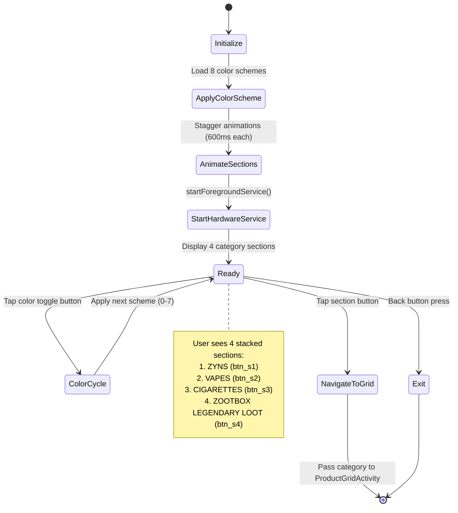

### 2. ProductGridActivity State Machine

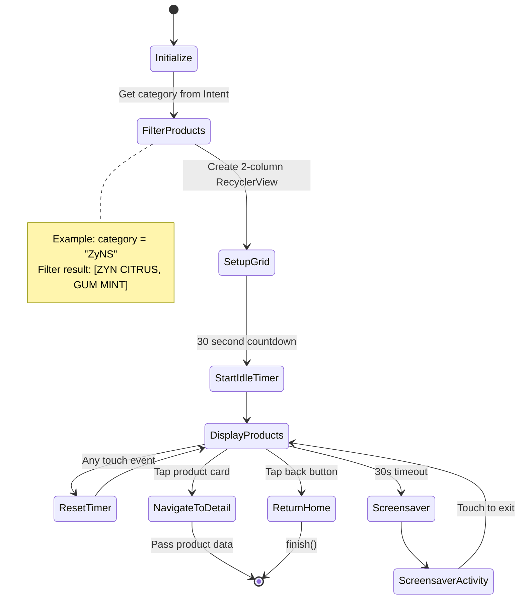

### 3. ProductDetailActivity State Machine

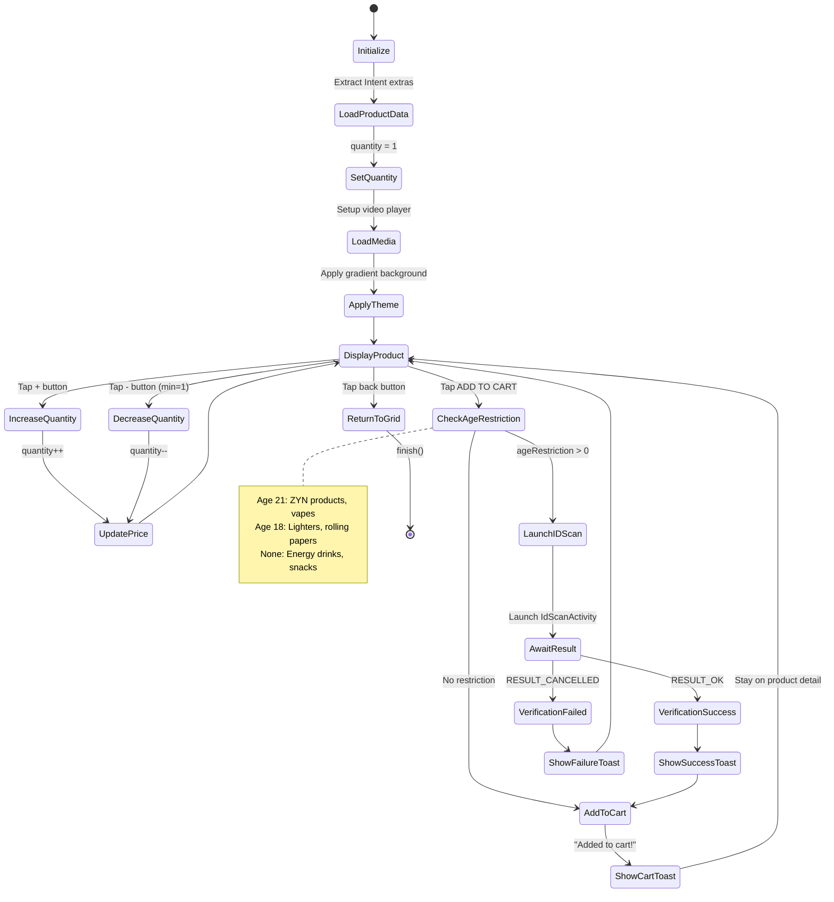

### 4. IdScanActivity State Machine

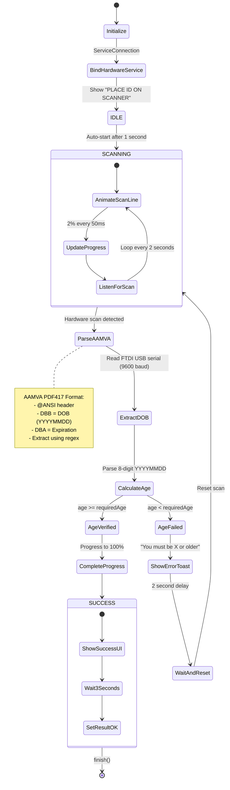

### 5. ScreensaverActivity State Machine

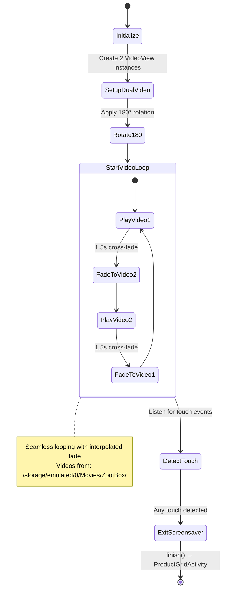

---

## Hardware Integration Flow

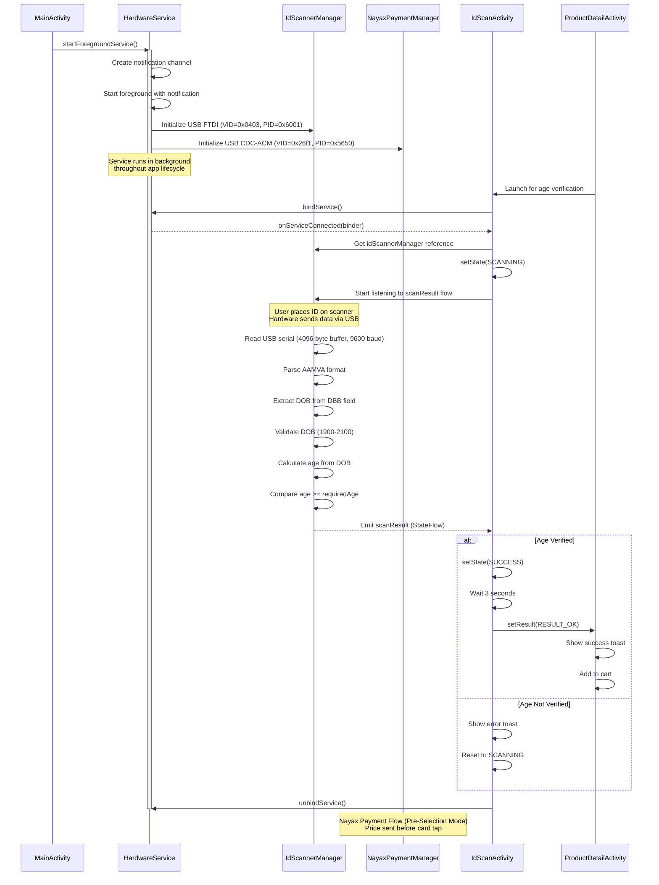

---

## Nayax Payment State Machine (Pre-Selection Mode)

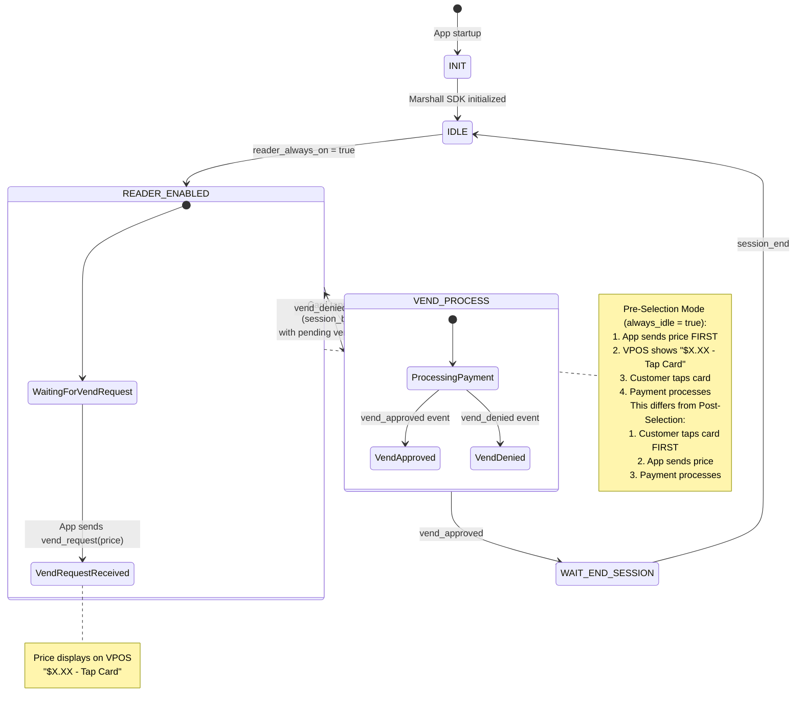

### Pre-Selection vs Post-Selection Flow Comparison

| Aspect | Pre-Selection (ZootBox) | Post-Selection |
|--------|------------------------|----------------|
| **Config** | `always_idle = true` | `always_idle = false` |
| **Sequence** | Price → Card Tap → Payment | Card Tap → Price → Payment |
| **vend_request state** | READER_ENABLED (state 2) | WAIT_VEND_REQUEST (state 3) |
| **Display** | Shows price immediately | Shows "Tap Card" until price sent |
| **Use Case** | Known price before checkout | Dynamic pricing after card tap |

### vmc_vend_t State Machine Reference

| State | ID | Description |
|-------|-----|-------------|
| INIT | 0 | SDK initializing |
| IDLE | 1 | Ready, reader disabled |
| READER_ENABLED | 2 | Card reader active, showing "Tap Card" |
| WAIT_VEND_REQUEST | 3 | Card tapped, waiting for price (Post-Selection only) |
| VEND_PROCESS | 4 | Processing payment |
| WAIT_END_SESSION | 5 | Transaction complete, waiting for cleanup |
| DISABLED | 6 | Reader disabled |

---

## Backend API & Inventory Management Flow

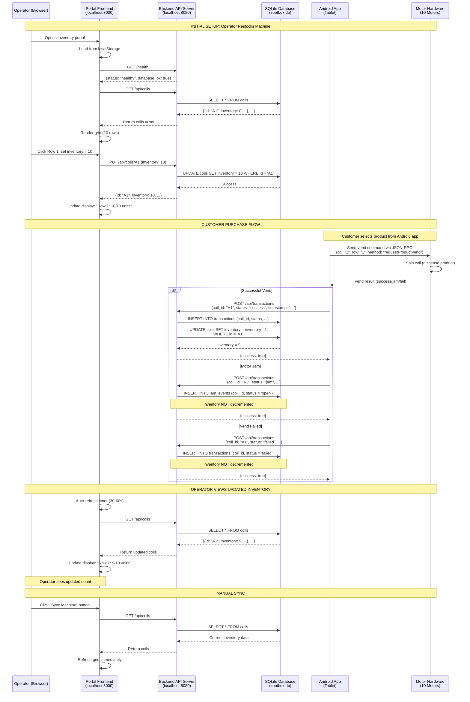

### Backend API Endpoints

```mermaid
graph TB
    subgraph "Backend API Server (Go) - Port 8080"
        Health["/health<br/>GET - Health check"]
        Metrics["/metrics<br/>GET - Prometheus metrics"]

        subgraph "Coil Management"
            GetCoils["/api/coils<br/>GET - Fetch all coils"]
            UpdateCoil["/api/coils/:id<br/>PUT - Update coil inventory"]
        end

        subgraph "Transaction Tracking"
            GetTxns["/api/transactions<br/>GET - Transaction history"]
            CreateTxn["/api/transactions<br/>POST - Record vend attempt"]
        end

        subgraph "Jam Management"
            GetJams["/api/jam-events<br/>GET - List jam events"]
            CreateJam["/api/jam-events<br/>POST - Report jam"]
            ResolveJam["/api/jam-events/:id<br/>PUT - Mark resolved"]
        end

        subgraph "Product Links"
            GetLinks["/api/product-links<br/>GET - Product assignments"]
            CreateLink["/api/product-links<br/>POST - Create link"]
            DeleteLink["/api/product-links/:id<br/>DELETE - Remove link"]
        end
    end

    Portal[Portal Frontend] -->|HTTP/JSON| GetCoils
    Portal -->|HTTP/JSON| UpdateCoil
    Portal -->|HTTP/JSON| GetJams
    Portal -->|HTTP/JSON| GetLinks
    Portal -->|HTTP/JSON| Health

    Android[Android App] -->|HTTP/JSON| CreateTxn
    Android -->|HTTP/JSON| CreateJam
    Android -->|HTTP/JSON| GetCoils

    GetCoils --> DB[(SQLite DB)]
    UpdateCoil --> DB
    CreateTxn --> DB
    GetJams --> DB
    CreateJam --> DB

    style Portal fill:#e1f5ff
    style Android fill:#c8e6c9
    style DB fill:#fff9c4
```

### Inventory State Machine

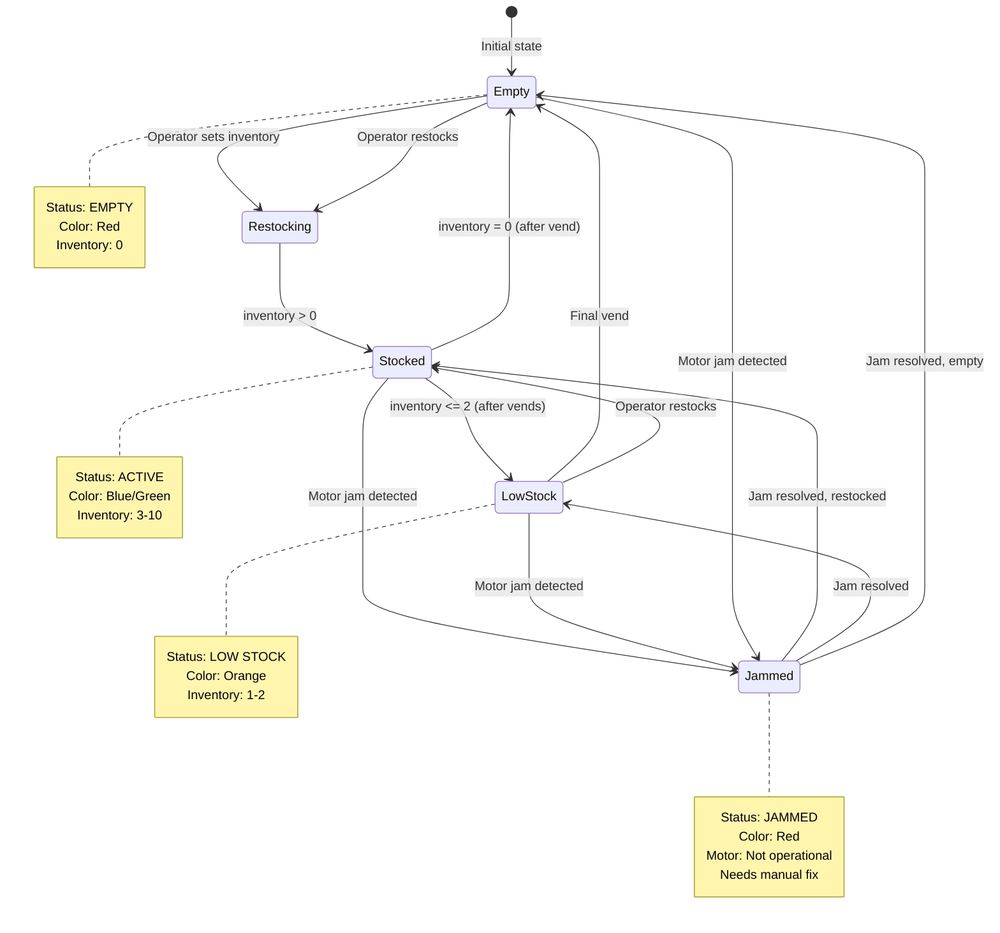

### Database Schema

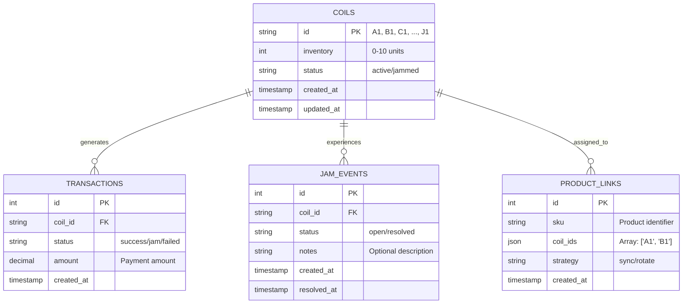

### Data Persistence & Caching

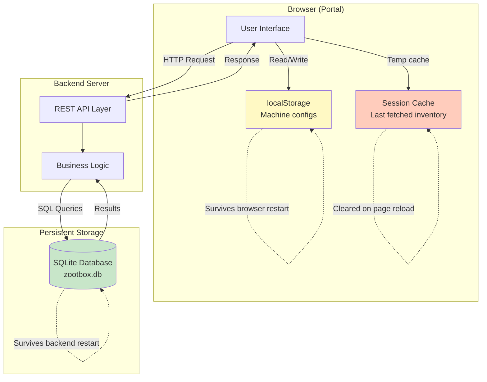

### Network Communication Flow

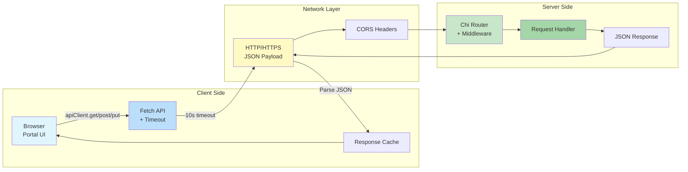

---

## Data Flow Diagram

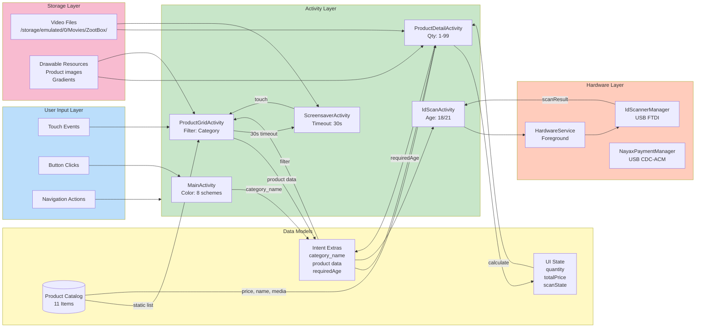

---

## Product Catalog Data Structure

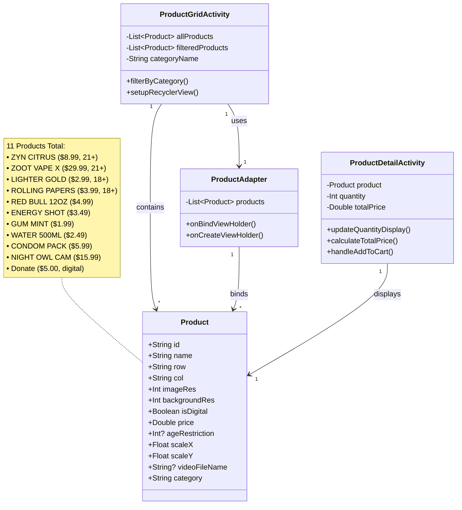

---

## Complete User Journey Timeline

```mermaid
gantt
    title ZootBox User Journey: From Launch to Purchase
    dateFormat X
    axisFormat %S

    section App Launch
    MainActivity loads           :milestone, 0, 0
    Color scheme applied         :active, 0, 1
    Sections animate             :active, 1, 2
    HardwareService starts       :active, 2, 3
    User sees categories         :milestone, 3, 3

    section Category Selection
    User browses sections        :active, 3, 8
    User taps "ZYNS"            :milestone, 8, 8

    section Product Grid
    ProductGridActivity loads    :active, 8, 9
    Filter by category           :active, 9, 10
    Display 2 products           :active, 10, 11
    User browses grid            :active, 11, 18
    User taps "ZYN CITRUS"      :milestone, 18, 18

    section Product Detail
    ProductDetailActivity loads  :active, 18, 19
    Load product video           :active, 19, 20
    Display product info         :active, 20, 21
    User adjusts quantity        :active, 21, 26
    User taps ADD TO CART        :milestone, 26, 26

    section Age Verification
    IdScanActivity launches      :active, 26, 27
    IDLE state (1s)              :active, 27, 28
    SCANNING state               :active, 28, 33
    User scans ID                :milestone, 30, 30
    Parse AAMVA data             :active, 30, 31
    Calculate age                :active, 31, 32
    Age verified                 :milestone, 32, 32
    SUCCESS state (3s)           :active, 32, 35

    section Purchase Complete
    Return to ProductDetail      :active, 35, 36
    Show success toast           :active, 36, 37
    Add to cart                  :milestone, 37, 37
    Activity finishes            :crit, 37, 38

    section Screensaver Path
    30s idle on grid             :done, 11, 41
    Screensaver activates        :done, 41, 42
    User touches screen          :done, 45, 45
    Return to grid               :done, 45, 46
```

---

## Key Metrics & Configuration

### Timing Configuration
| Event | Duration | Configurable |
|-------|----------|--------------|
| Section animation stagger | 600ms per section | Yes - MainActivity |
| Idle timeout to screensaver | 30 seconds | Yes - ProductGridActivity |
| ID scan IDLE state | 1 second | Yes - IdScanActivity |
| Scanning line animation | 2 seconds per loop | Yes - IdScanActivity |
| Success screen display | 3 seconds | Yes - IdScanActivity |
| Screensaver fade duration | 1.5 seconds | Yes - ScreensaverActivity |
| Progress increment | 2% per 50ms | Yes - IdScanActivity |

### Hardware Configuration
| Device | VID | PID | Protocol | Baud Rate | Driver |
|--------|-----|-----|----------|-----------|--------|
| E-Seek M260 ID Scanner | 0x0403 | 0x6001 | USB Serial | **9600** | FTDI |
| Nayax VPOS Touch Payment | 0x0403 | 0x6015 | USB Serial (FTDI) | **115200** | FtdiSerialDriver |

**Note:** The Nayax VPOS has two USB interfaces. The FTDI interface (0403:6015) must be used - the CDC-ACM interface (26f1:5650) does NOT work.

### Marshall SDK Configuration (NayaxPaymentManager.kt)
| Parameter | Value | Purpose |
|-----------|-------|---------|
| `reader_always_on` | `true` | Keep card reader enabled, showing "Tap Card" |
| `always_idle` | `true` | Enable Pre-Selection mode (app sends price before card tap) |
| `multi_vend_support` | `false` | Single item transactions |
| `vend_response_timeout` | `30000` | 30 second payment timeout |

### Product Categories
| Category | Product Count | Age Restricted |
|----------|---------------|----------------|
| ZyNS | 2 | 1 @ 21+ |
| VAPES | 1 | 1 @ 21+ |
| CIGERATES | 2 | 2 @ 18+ |
| ZOOTBOX LEGENDARY LOOT | 6 | 0 |

### UI Grid Configuration
- **ProductGridActivity**: 2 columns (GridLayoutManager)
- **Total Products**: 11
- **Filtering**: Category-based exact match
- **Image Scaling**: Per-product scaleX/scaleY values

---

## Notes

1. **Hardware Fully Integrated**: Both ID Scanner (E-Seek M260) and Nayax VPOS Touch payment reader are fully functional via USB.

2. **Payment Integration Complete**: NayaxPaymentManager uses the Marshall SDK to communicate with the Nayax VPOS Touch. The reader shows "Tap Card" and is ready for contactless payments. The `vmc_vend_t.handleMessage()` method was manually reconstructed after JADX decompilation failure.

3. **No Cart Persistence**: "Add to cart" operations show success messages but don't persist to a database or shared cart state.

4. **Video Storage**: Videos must be manually placed in `/storage/emulated/0/Movies/ZootBox/` directory. The app doesn't bundle videos in assets/raw.

5. **Age Verification**: AAMVA parsing extracts DOB from DAA field using 8-digit YYYYMMDD format. Age calculation accounts for current year, month, and day.

6. **Color Schemes**: MainActivity supports 8 predefined color schemes that cycle with the circular toggle button. Each scheme applies colors to all 4 sections.

7. **Screensaver Activation**: Only triggered from ProductGridActivity after 30s of inactivity. Other activities don't implement idle detection.

8. **Back Navigation**: All activities use standard back stack behavior. No custom back handling beyond standard `finish()` calls.

9. **Critical Baud Rate Fix (Jan 2026)**: ID Scanner and Nayax payment terminal now use separate baud rate constants. Previously, when Nayax integration was added, both devices incorrectly shared `SERIAL_BAUD_RATE = 115200`, causing the ID scanner to receive binary garbage instead of ASCII AAMVA text. Now fixed with `ID_SCANNER_BAUD_RATE = 9600` and `NAYAX_BAUD_RATE = 115200`.

10. **Cart Checkout Flow**: CartActivity now checks for age-restricted items before payment. If the cart contains any products requiring age verification, it launches IdScanActivity with the highest required age. After successful verification, payment proceeds normally.

11. **Nayax Payment Flow - Pre-Selection Mode with Motor Dispensing (Jan 2026)**: The Nayax VPOS Touch integration uses the Marshall SDK extracted from DMVI's APK with **Pre-Selection flow** (app sends price BEFORE card tap) and **full motor dispensing integration**. Key configuration: `reader_always_on = true` keeps the card reader enabled showing "Tap Card", and `always_idle = true` enables Pre-Selection mode. The complete end-to-end flow is: Product Selection → ID Scan → Payment Initiation (vend_request) → Card Tap (session_begin) → Payment Approval (vend_approved) → **Motor Dispensing** → Transaction Settlement. Critical bug fixes: (1) `vmc_vend_t.handleMessage()` vend_approved handler now fires callback in both state 2 (READER_ENABLED, Pre-Selection) and state 4 (VEND_PROCESS, Post-Selection); (2) `ProductDetailActivity` refactored to extract `dispenseProducts()` function, eliminating double payment initiation in "Add to Cart" flow; (3) Motors now trigger immediately after payment approval via `MotorControlManager.vendMotor()` which sends JSON-RPC commands to DMVI service on port 57482.

12. **USB Device Priority**: When detecting USB devices, the app prefers the FTDI interface (VID=0x0403, PID=0x6015) over the CDC-ACM interface (VID=0x26f1, PID=0x5650) for Nayax. Both interfaces appear on the same physical device, but only FTDI works with Marshall protocol.

13. **Immediate Inventory Sync (Jan 2026)**: The `InventoryRepository` now triggers `BackgroundSyncService.syncNow()` on every inventory change (`updateInventory()`, `resetAllInventory()`). This ensures the portal sees changes within seconds instead of waiting up to 1 hour. The sync uses `NetworkType.NOT_REQUIRED` constraint since it communicates with localhost. A `network_security_config.xml` was added to allow cleartext HTTP to localhost on Android 9+.

14. **Backend HTTP_HOST Configuration (Jan 2026)**: The Go backend must start with `HTTP_HOST=0.0.0.0` (not `127.0.0.1`) for the portal to connect via Tailscale VPN. The backend database has exactly 10 coils (A1-J1) matching the 10 motors in the vending machine.
