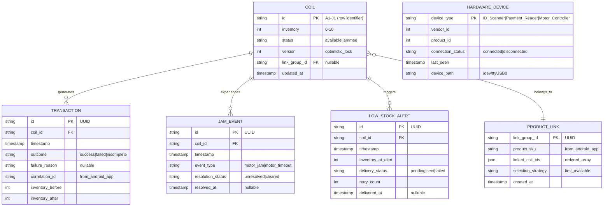

# Data Model: ZootBox Coil-Counter Backend

**Feature**: `001-coil-counter-backend`
**Database**: SQLite3 with WAL mode
**Schema Version**: 1.0.0

---

## Entity Relationship Diagram



---

## Table Schemas

### 1. coils

Primary inventory table tracking 10 coil positions (A1-J1, one per row).

```sql
CREATE TABLE coils (
    id TEXT PRIMARY KEY,              -- 'A1' to 'J10' (row A-J, column 1-10)
    inventory INTEGER NOT NULL DEFAULT 10 CHECK (inventory >= 0 AND inventory <= 10),
    status TEXT NOT NULL DEFAULT 'available' CHECK (status IN ('available', 'jammed')),
    version INTEGER NOT NULL DEFAULT 1,  -- Optimistic locking (incremented on every update)
    link_group_id TEXT,               -- Foreign key to product_links (nullable, not all coils linked)
    updated_at TIMESTAMP DEFAULT CURRENT_TIMESTAMP,
    FOREIGN KEY (link_group_id) REFERENCES product_links(link_group_id)
);

-- Index for link group lookups (multi-coil products)
CREATE INDEX idx_coils_link_group ON coils(link_group_id) WHERE link_group_id IS NOT NULL;

-- Index for low-stock queries
CREATE INDEX idx_coils_low_stock ON coils(inventory) WHERE inventory <= 2;

-- Trigger to update updated_at on modification
CREATE TRIGGER update_coils_timestamp
AFTER UPDATE ON coils
FOR EACH ROW
BEGIN
    UPDATE coils SET updated_at = CURRENT_TIMESTAMP WHERE id = NEW.id;
END;
```

**Initial Data**: 10 rows inserted during migration (A1-J1, all inventory=10, status='available').

---

### 2. transactions

Immutable log of all vend attempts (success and failures).

```sql
CREATE TABLE transactions (
    id TEXT PRIMARY KEY,              -- UUID v4
    coil_id TEXT NOT NULL,
    timestamp TIMESTAMP NOT NULL DEFAULT CURRENT_TIMESTAMP,
    outcome TEXT NOT NULL CHECK (outcome IN ('success', 'failed', 'incomplete')),
    failure_reason TEXT,              -- Nullable (populated only if outcome='failed')
                                      -- Examples: 'out_of_stock', 'motor_jam', 'version_conflict'
    correlation_id TEXT NOT NULL,     -- From Android app's HTTP request header (X-Correlation-ID)
    inventory_before INTEGER NOT NULL,
    inventory_after INTEGER,          -- Nullable (NULL if outcome='failed')
    FOREIGN KEY (coil_id) REFERENCES coils(id)
);

-- Index for transaction history queries (by coil)
CREATE INDEX idx_transactions_coil ON transactions(coil_id, timestamp DESC);

-- Index for correlation ID tracing (Android app → backend)
CREATE INDEX idx_transactions_correlation ON transactions(correlation_id);

-- Index for incomplete transaction recovery (power loss detection)
CREATE INDEX idx_transactions_incomplete ON transactions(outcome) WHERE outcome = 'incomplete';
```

**Retention Policy**: Transactions older than 90 days deleted via cron job (spec assumption: 90-day retention).

---

### 3. jam_events

Hardware failure log for motor jams and timeouts.

```sql
CREATE TABLE jam_events (
    id TEXT PRIMARY KEY,              -- UUID v4
    coil_id TEXT NOT NULL,
    timestamp TIMESTAMP NOT NULL DEFAULT CURRENT_TIMESTAMP,
    event_type TEXT NOT NULL CHECK (event_type IN ('motor_jam', 'motor_timeout')),
    resolution_status TEXT NOT NULL DEFAULT 'unresolved' CHECK (resolution_status IN ('unresolved', 'cleared')),
    resolved_at TIMESTAMP,            -- Nullable (set when operator clears jam via admin interface)
    FOREIGN KEY (coil_id) REFERENCES coils(id)
);

-- Index for unresolved jams (admin dashboard query)
CREATE INDEX idx_jam_events_unresolved ON jam_events(resolution_status, timestamp DESC) WHERE resolution_status = 'unresolved';

-- Index for coil-specific jam history
CREATE INDEX idx_jam_events_coil ON jam_events(coil_id, timestamp DESC);
```

**Business Rule**: When jam event created, corresponding coil status updated to 'jammed'. Coil remains jammed until operator manually clears via admin interface.

---

### 4. low_stock_alerts

Alert queue for external monitoring system push notifications.

```sql
CREATE TABLE low_stock_alerts (
    id TEXT PRIMARY KEY,              -- UUID v4
    coil_id TEXT NOT NULL,
    timestamp TIMESTAMP NOT NULL DEFAULT CURRENT_TIMESTAMP,
    inventory_at_alert INTEGER NOT NULL CHECK (inventory_at_alert <= 2),
    delivery_status TEXT NOT NULL DEFAULT 'pending' CHECK (delivery_status IN ('pending', 'sent', 'failed')),
    retry_count INTEGER NOT NULL DEFAULT 0,
    delivered_at TIMESTAMP,           -- Nullable (set when webhook POST succeeds)
    FOREIGN KEY (coil_id) REFERENCES coils(id)
);

-- Index for pending alert delivery (background worker query)
CREATE INDEX idx_alerts_pending ON low_stock_alerts(delivery_status, retry_count) WHERE delivery_status = 'pending';

-- Prevent duplicate alerts for same coil (only one pending alert per coil)
CREATE UNIQUE INDEX idx_alerts_unique_pending ON low_stock_alerts(coil_id) WHERE delivery_status = 'pending';
```

**Retry Logic**: Background goroutine processes pending alerts with exponential backoff (100ms, 200ms, 400ms). Max 3 retries before marking failed.

---

### 5. product_links

Multi-coil product configuration (e.g., coils A1, A2, A3 all linked to SKU "Coca-Cola").

```sql
CREATE TABLE product_links (
    link_group_id TEXT PRIMARY KEY,   -- UUID v4
    product_sku TEXT NOT NULL,        -- From Android app (e.g., "PRODUCT_001")
    linked_coil_ids TEXT NOT NULL,    -- JSON array: ["A1", "A2", "A3"] (ordered by priority)
    selection_strategy TEXT NOT NULL DEFAULT 'first_available' CHECK (selection_strategy = 'first_available'),
    created_at TIMESTAMP NOT NULL DEFAULT CURRENT_TIMESTAMP
);

-- Index for SKU-based lookups (vend operation queries linked coils by product SKU)
CREATE INDEX idx_product_links_sku ON product_links(product_sku);
```

**JSON Schema** (`linked_coil_ids`):
```json
["A1", "A2", "A3"]
```

**Business Rule**: When vending linked product, iterate through `linked_coil_ids` array in order. Select first coil with `inventory > 0` and `status = 'available'`.

---

### 6. hardware_devices

Hardware connection status tracking (USB devices).

```sql
CREATE TABLE hardware_devices (
    device_type TEXT PRIMARY KEY,     -- 'ID_Scanner' | 'Payment_Reader' | 'Motor_Controller'
    vendor_id INTEGER NOT NULL,       -- USB VID (e.g., 0x0403 for ID Scanner)
    product_id INTEGER NOT NULL,      -- USB PID (e.g., 0x6001 for ID Scanner)
    connection_status TEXT NOT NULL DEFAULT 'disconnected' CHECK (connection_status IN ('connected', 'disconnected')),
    last_seen TIMESTAMP,              -- Nullable (last successful communication timestamp)
    device_path TEXT                  -- '/dev/ttyUSB0' or similar
);

-- Seed data inserted during migration
INSERT INTO hardware_devices (device_type, vendor_id, product_id) VALUES
    ('ID_Scanner', 0x0403, 0x6001),
    ('Payment_Reader', 0x26f1, 0x5650),
    ('Motor_Controller', 0x0000, 0x0000);  -- VID/PID unknown (placeholder)
```

**Update Pattern**: Background goroutine pings each device every 5 seconds. Updates `connection_status` and `last_seen` on successful response.

---

## Go Structs (Domain Models)

### Coil

```go
package models

import "time"

type Coil struct {
    ID           string    `json:"id" db:"id"`                     // "A5"
    Inventory    int       `json:"inventory" db:"inventory"`       // 0-10
    Status       string    `json:"status" db:"status"`             // "available" | "jammed"
    Version      int       `json:"version" db:"version"`           // Optimistic lock
    LinkGroupID  *string   `json:"link_group_id,omitempty" db:"link_group_id"` // Nullable
    UpdatedAt    time.Time `json:"updated_at" db:"updated_at"`
}

type CoilStatus string

const (
    CoilStatusAvailable CoilStatus = "available"
    CoilStatusJammed    CoilStatus = "jammed"
)
```

**JSON Serialization** (Android app expects this format):
```json
{
  "id": "A5",
  "inventory": 7,
  "status": "available",
  "version": 42,
  "link_group_id": null,
  "updated_at": "2025-12-27T10:30:00Z"
}
```

---

### Transaction

```go
package models

import "time"

type Transaction struct {
    ID              string    `json:"id" db:"id"`
    CoilID          string    `json:"coil_id" db:"coil_id"`
    Timestamp       time.Time `json:"timestamp" db:"timestamp"`
    Outcome         string    `json:"outcome" db:"outcome"`           // "success" | "failed" | "incomplete"
    FailureReason   *string   `json:"failure_reason,omitempty" db:"failure_reason"` // Nullable
    CorrelationID   string    `json:"correlation_id" db:"correlation_id"`
    InventoryBefore int       `json:"inventory_before" db:"inventory_before"`
    InventoryAfter  *int      `json:"inventory_after,omitempty" db:"inventory_after"` // Nullable if failed
}

type TransactionOutcome string

const (
    OutcomeSuccess    TransactionOutcome = "success"
    OutcomeFailed     TransactionOutcome = "failed"
    OutcomeIncomplete TransactionOutcome = "incomplete"
)
```

---

### JamEvent

```go
package models

import "time"

type JamEvent struct {
    ID               string     `json:"id" db:"id"`
    CoilID           string     `json:"coil_id" db:"coil_id"`
    Timestamp        time.Time  `json:"timestamp" db:"timestamp"`
    EventType        string     `json:"event_type" db:"event_type"`     // "motor_jam" | "motor_timeout"
    ResolutionStatus string     `json:"resolution_status" db:"resolution_status"` // "unresolved" | "cleared"
    ResolvedAt       *time.Time `json:"resolved_at,omitempty" db:"resolved_at"`
}
```

---

### LowStockAlert

```go
package models

import "time"

type LowStockAlert struct {
    ID                string     `json:"id" db:"id"`
    CoilID            string     `json:"coil_id" db:"coil_id"`
    Timestamp         time.Time  `json:"timestamp" db:"timestamp"`
    InventoryAtAlert  int        `json:"inventory_at_alert" db:"inventory_at_alert"`
    DeliveryStatus    string     `json:"delivery_status" db:"delivery_status"` // "pending" | "sent" | "failed"
    RetryCount        int        `json:"retry_count" db:"retry_count"`
    DeliveredAt       *time.Time `json:"delivered_at,omitempty" db:"delivered_at"`
}
```

---

### ProductLink

```go
package models

import (
    "database/sql/driver"
    "encoding/json"
    "time"
)

type ProductLink struct {
    LinkGroupID       string    `json:"link_group_id" db:"link_group_id"`
    ProductSKU        string    `json:"product_sku" db:"product_sku"`
    LinkedCoilIDs     CoilIDs   `json:"linked_coil_ids" db:"linked_coil_ids"` // Custom type for JSON array
    SelectionStrategy string    `json:"selection_strategy" db:"selection_strategy"`
    CreatedAt         time.Time `json:"created_at" db:"created_at"`
}

// CoilIDs is a custom type for JSON array scanning/valuing
type CoilIDs []string

func (c *CoilIDs) Scan(value interface{}) error {
    bytes, ok := value.([]byte)
    if !ok {
        return fmt.Errorf("failed to scan CoilIDs")
    }
    return json.Unmarshal(bytes, c)
}

func (c CoilIDs) Value() (driver.Value, error) {
    return json.Marshal(c)
}
```

---

### HardwareDevice

```go
package models

import "time"

type HardwareDevice struct {
    DeviceType       string     `json:"device_type" db:"device_type"`
    VendorID         int        `json:"vendor_id" db:"vendor_id"`
    ProductID        int        `json:"product_id" db:"product_id"`
    ConnectionStatus string     `json:"connection_status" db:"connection_status"`
    LastSeen         *time.Time `json:"last_seen,omitempty" db:"last_seen"`
    DevicePath       *string    `json:"device_path,omitempty" db:"device_path"`
}
```

---

## Database Migrations

### Migration 001: Initial Schema

File: `internal/db/migrations/001_init_schema.sql`

```sql
-- Enable WAL mode for concurrent reads
PRAGMA journal_mode=WAL;
PRAGMA busy_timeout=5000;

-- Create tables in dependency order
CREATE TABLE IF NOT EXISTS product_links (
    link_group_id TEXT PRIMARY KEY,
    product_sku TEXT NOT NULL,
    linked_coil_ids TEXT NOT NULL,
    selection_strategy TEXT NOT NULL DEFAULT 'first_available',
    created_at TIMESTAMP NOT NULL DEFAULT CURRENT_TIMESTAMP
);

CREATE TABLE IF NOT EXISTS coils (
    id TEXT PRIMARY KEY,
    inventory INTEGER NOT NULL DEFAULT 10 CHECK (inventory >= 0 AND inventory <= 10),
    status TEXT NOT NULL DEFAULT 'available' CHECK (status IN ('available', 'jammed')),
    version INTEGER NOT NULL DEFAULT 1,
    link_group_id TEXT,
    updated_at TIMESTAMP DEFAULT CURRENT_TIMESTAMP,
    FOREIGN KEY (link_group_id) REFERENCES product_links(link_group_id)
);

CREATE TABLE IF NOT EXISTS transactions (
    id TEXT PRIMARY KEY,
    coil_id TEXT NOT NULL,
    timestamp TIMESTAMP NOT NULL DEFAULT CURRENT_TIMESTAMP,
    outcome TEXT NOT NULL CHECK (outcome IN ('success', 'failed', 'incomplete')),
    failure_reason TEXT,
    correlation_id TEXT NOT NULL,
    inventory_before INTEGER NOT NULL,
    inventory_after INTEGER,
    FOREIGN KEY (coil_id) REFERENCES coils(id)
);

CREATE TABLE IF NOT EXISTS jam_events (
    id TEXT PRIMARY KEY,
    coil_id TEXT NOT NULL,
    timestamp TIMESTAMP NOT NULL DEFAULT CURRENT_TIMESTAMP,
    event_type TEXT NOT NULL CHECK (event_type IN ('motor_jam', 'motor_timeout')),
    resolution_status TEXT NOT NULL DEFAULT 'unresolved',
    resolved_at TIMESTAMP,
    FOREIGN KEY (coil_id) REFERENCES coils(id)
);

CREATE TABLE IF NOT EXISTS low_stock_alerts (
    id TEXT PRIMARY KEY,
    coil_id TEXT NOT NULL,
    timestamp TIMESTAMP NOT NULL DEFAULT CURRENT_TIMESTAMP,
    inventory_at_alert INTEGER NOT NULL CHECK (inventory_at_alert <= 2),
    delivery_status TEXT NOT NULL DEFAULT 'pending',
    retry_count INTEGER NOT NULL DEFAULT 0,
    delivered_at TIMESTAMP,
    FOREIGN KEY (coil_id) REFERENCES coils(id)
);

CREATE TABLE IF NOT EXISTS hardware_devices (
    device_type TEXT PRIMARY KEY,
    vendor_id INTEGER NOT NULL,
    product_id INTEGER NOT NULL,
    connection_status TEXT NOT NULL DEFAULT 'disconnected',
    last_seen TIMESTAMP,
    device_path TEXT
);

-- Create indexes
CREATE INDEX idx_coils_link_group ON coils(link_group_id) WHERE link_group_id IS NOT NULL;
CREATE INDEX idx_coils_low_stock ON coils(inventory) WHERE inventory <= 2;
CREATE INDEX idx_transactions_coil ON transactions(coil_id, timestamp DESC);
CREATE INDEX idx_transactions_correlation ON transactions(correlation_id);
CREATE INDEX idx_transactions_incomplete ON transactions(outcome) WHERE outcome = 'incomplete';
CREATE INDEX idx_jam_events_unresolved ON jam_events(resolution_status, timestamp DESC) WHERE resolution_status = 'unresolved';
CREATE INDEX idx_jam_events_coil ON jam_events(coil_id, timestamp DESC);
CREATE INDEX idx_alerts_pending ON low_stock_alerts(delivery_status, retry_count) WHERE delivery_status = 'pending';
CREATE UNIQUE INDEX idx_alerts_unique_pending ON low_stock_alerts(coil_id) WHERE delivery_status = 'pending';
CREATE INDEX idx_product_links_sku ON product_links(product_sku);

-- Trigger for updated_at
CREATE TRIGGER update_coils_timestamp
AFTER UPDATE ON coils
FOR EACH ROW
BEGIN
    UPDATE coils SET updated_at = CURRENT_TIMESTAMP WHERE id = NEW.id;
END;

-- Seed data: 100 coils (A1-J10)
INSERT INTO coils (id) VALUES
    ('A1'), ('A2'), ('A3'), ('A4'), ('A5'), ('A6'), ('A7'), ('A8'), ('A9'), ('A10'),
    ('B1'), ('B2'), ('B3'), ('B4'), ('B5'), ('B6'), ('B7'), ('B8'), ('B9'), ('B10'),
    ('C1'), ('C2'), ('C3'), ('C4'), ('C5'), ('C6'), ('C7'), ('C8'), ('C9'), ('C10'),
    ('D1'), ('D2'), ('D3'), ('D4'), ('D5'), ('D6'), ('D7'), ('D8'), ('D9'), ('D10'),
    ('E1'), ('E2'), ('E3'), ('E4'), ('E5'), ('E6'), ('E7'), ('E8'), ('E9'), ('E10'),
    ('F1'), ('F2'), ('F3'), ('F4'), ('F5'), ('F6'), ('F7'), ('F8'), ('F9'), ('F10'),
    ('G1'), ('G2'), ('G3'), ('G4'), ('G5'), ('G6'), ('G7'), ('G8'), ('G9'), ('G10'),
    ('H1'), ('H2'), ('H3'), ('H4'), ('H5'), ('H6'), ('H7'), ('H8'), ('H9'), ('H10'),
    ('I1'), ('I2'), ('I3'), ('I4'), ('I5'), ('I6'), ('I7'), ('I8'), ('I9'), ('I10'),
    ('J1'), ('J2'), ('J3'), ('J4'), ('J5'), ('J6'), ('J7'), ('J8'), ('J9'), ('J10');

-- Seed hardware devices
INSERT INTO hardware_devices (device_type, vendor_id, product_id) VALUES
    ('ID_Scanner', 0x0403, 0x6001),
    ('Payment_Reader', 0x26f1, 0x5650),
    ('Motor_Controller', 0x0000, 0x0000);
```

---

## Data Access Patterns

### Pattern 1: Optimistic Locking (Vend Operation)

```go
func (r *CoilRepository) DecrementInventory(ctx context.Context, coilID string, currentVersion int) error {
    result, err := r.db.ExecContext(ctx,
        `UPDATE coils
         SET inventory = inventory - 1, version = version + 1
         WHERE id = ? AND version = ?`,
        coilID, currentVersion,
    )
    if err != nil {
        return err
    }

    rowsAffected, _ := result.RowsAffected()
    if rowsAffected == 0 {
        return ErrVersionConflict  // Another request modified this coil
    }

    return nil
}
```

### Pattern 2: Multi-Coil Linked Product Selection

```go
func (r *ProductLinkRepository) SelectAvailableCoil(ctx context.Context, productSKU string) (*models.Coil, error) {
    // Get linked coil IDs for this product
    var linkedCoilIDs models.CoilIDs
    err := r.db.GetContext(ctx, &linkedCoilIDs,
        `SELECT linked_coil_ids FROM product_links WHERE product_sku = ?`,
        productSKU,
    )

    // Iterate through linked coils in priority order
    for _, coilID := range linkedCoilIDs {
        var coil models.Coil
        err := r.db.GetContext(ctx, &coil,
            `SELECT * FROM coils WHERE id = ? AND inventory > 0 AND status = 'available'`,
            coilID,
        )
        if err == nil {
            return &coil, nil  // Found first available coil
        }
    }

    return nil, ErrAllLinkedCoilsEmpty
}
```

### Pattern 3: Transaction Log with Correlation ID

```go
func (r *TransactionRepository) Create(ctx context.Context, tx *models.Transaction) error {
    _, err := r.db.ExecContext(ctx,
        `INSERT INTO transactions (id, coil_id, timestamp, outcome, failure_reason, correlation_id, inventory_before, inventory_after)
         VALUES (?, ?, ?, ?, ?, ?, ?, ?)`,
        tx.ID, tx.CoilID, tx.Timestamp, tx.Outcome, tx.FailureReason, tx.CorrelationID, tx.InventoryBefore, tx.InventoryAfter,
    )
    return err
}
```

---

## Summary

- **6 Tables**: coils, transactions, jam_events, low_stock_alerts, product_links, hardware_devices
- **100 Coil Records**: A1-J10 grid, all initialized to inventory=10
- **Optimistic Locking**: Version column on coils table prevents concurrent modification conflicts
- **Immutable Logs**: Transactions and jam events are append-only (no updates/deletes)
- **JSON Support**: linked_coil_ids stored as JSON array, scanned/valued via custom Go type
- **WAL Mode**: Concurrent reads while writer active (constitution requirement: Android app reads while backend writes)
- **Indexes**: Optimized for low-stock queries, transaction tracing, unresolved jams, pending alerts

**Next**: Generate OpenAPI contracts (`contracts/openapi.yaml`)
