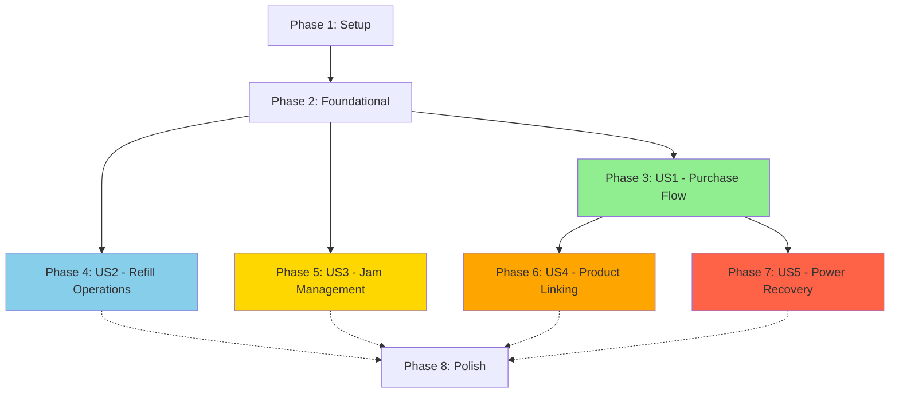

/# Implementation Tasks: ZootBox Coil-Counter Backend

**Feature**: `001-coil-counter-backend` | **Date**: 2025-12-27
**Input**: [spec.md](./spec.md), [plan.md](./plan.md), [data-model.md](./data-model.md), [contracts/openapi.yaml](./contracts/openapi.yaml)

---

## Implementation Strategy

**MVP Scope**: User Story 1 (Customer Purchase Flow) - Backend passively records vend outcomes reported by Android app

**Incremental Delivery**:
1. **Milestone 1 (MVP)**: US1 - Android reports vend outcomes, backend records transactions and updates inventory
2. **Milestone 2**: US2 - Route drivers can refill machines efficiently via admin API
3. **Milestone 3**: US3 - Operators can review jam history and resolve jams via admin interface
4. **Milestone 4**: US4 - Multi-coil linking for high-demand products
5. **Milestone 5**: US5 - Power loss recovery guarantees

**Why This Order**: Prioritizes transaction recording (enables inventory tracking) → operational efficiency (refills) → jam management → product optimization → reliability enhancements

---

## Task Summary

| Phase | User Story | Task Count | Parallelizable | Independent Test |
|-------|-----------|------------|----------------|------------------|
| Phase 1 | Setup | 6 | 3 | N/A (infrastructure) |
| Phase 2 | Foundational | 8 | 5 | Database queries, health checks work |
| Phase 3 | US1 (P1) | 10 | 5 | Android reports vend, backend records transaction and updates inventory |
| Phase 4 | US2 (P2) | 5 | 3 | Route driver can refill all coils or specific coils via admin API |
| Phase 5 | US3 (P3) | 4 | 2 | Operator can review jam events and resolve jams via admin interface |
| Phase 6 | US4 (P4) | 5 | 3 | Linked products auto-select first available coil |
| Phase 7 | US5 (P5) | 4 | 1 | System recovers from power loss with no data loss |
| Phase 8 | Polish | 4 | 2 | Production deployment ready |
| **Total** | - | **46** | **24** | - |

---

## Dependencies

### User Story Completion Order



**Legend**:
- Solid arrows: Hard dependency (must complete before)
- Dotted arrows: Soft dependency (can start in parallel)
- **US2, US3 can start in parallel after Foundational phase completes**
- **US4 requires US1 (vend logic) but not US2 or US3**
- **US5 requires US1 (transaction logging) but can run parallel to US2/US3**

### Cross-Story Dependencies

| User Story | Depends On | Reason |
|-----------|-----------|--------|
| US1 | Foundational | Needs coils table, database layer, HTTP router |
| US2 | Foundational | Needs coils table, admin endpoints |
| US3 | Foundational | Needs jam_events table, admin endpoints |
| US4 | US1 | Extends transaction recording with product link selection |
| US5 | US1 | Requires transaction logging and recording logic |

---

## Phase 1: Setup

**Goal**: Initialize Go project structure, dependencies, and development environment

**Tasks**:

- [X] T001 Initialize Go module with `go mod init github.com/zootbox/backend` in Backend/ directory
- [X] T002 [P] Create cmd/server/main.go entry point with CLI flags (--log-level, --config, --migrate)
- [X] T003 [P] Create internal/config/config.go with environment variable loading (DB_PATH, HTTP_PORT, MONITORING_URL, MONITORING_AUTH, etc.)
- [X] T004 [P] Install core dependencies: chi v5, mattn/go-sqlite3, zerolog, testify
- [X] T005 Create Makefile with targets: run, build, test, build-arm64, install-tablet
- [X] T006 Create .gitignore for Go project (vendor/, *.db, build/, coverage.out)

**Parallel Execution**: T002, T003, T004 can run simultaneously (different files, no dependencies)

**Deliverable**: Backend/ directory with initialized Go project, all dependencies installed, ready for development

---

## Phase 2: Foundational Tasks

**Goal**: Implement shared infrastructure required by all user stories

**Independent Test**: Database connection succeeds, WAL mode enabled, coils table has 100 rows, GET /health returns 200 OK

**Tasks**:

- [X] T007 [P] Implement internal/db/sqlite.go with connection pool, WAL mode setup, busy_timeout=5000
- [X] T008 [P] Create SQL migration 001_init_schema.sql with coils, transactions, jam_events, hardware_devices, product_links, low_stock_alerts tables per data-model.md
- [X] T009 [P] Create SQL migration 002_seed_coils.sql with INSERT statements for 100 coils (A1-J10, inventory=10, status='available')
- [X] T010 [P] Implement migration runner in internal/db/migrations.go (reads .sql files, tracks applied migrations)
- [X] T011 Implement internal/models/coil.go struct with JSON tags matching OpenAPI schema
- [X] T012 [P] Implement internal/models/transaction.go, jam_event.go, hardware_device.go, product_link.go, low_stock_alert.go structs
- [X] T013 Implement internal/api/router.go with Chi router, CORS middleware, logging middleware, recovery middleware, correlation ID middleware
- [X] T014 Implement internal/api/handlers/health.go with GET /health endpoint (database ping, uptime)

**Parallel Execution**: T007-T010 (database layer), T011-T012 (models), T013-T014 (HTTP layer) can run in parallel

**Validation**:
```bash
# Run migrations
go run cmd/server/main.go --migrate

# Check database
sqlite3 /tmp/zootbox/inventory.db "SELECT COUNT(*) FROM coils;"  # Should return 100

# Start server and test health endpoint
go run cmd/server/main.go
curl http://localhost:8080/health  # Should return {"status":"healthy","uptime_seconds":5}
```

---

## Phase 3: User Story 1 - Customer Purchase Flow (P1)

**Story Goal**: Android app reports vend outcomes (success/jam/failed) from DMVI hardware, backend records transactions and updates inventory

**Independent Test**:
1. Android calls POST /api/v1/transactions with {coil_id:"A5", status:"success", timestamp, transaction_id}
2. Verify backend decrements inventory from 10 to 9 via GET /api/v1/coils/A5
3. Confirm transaction logged in database with status="success"
4. Verify Android receives 200 OK response with updated inventory count

**Acceptance Criteria**:
- ✅ FR-007: Inventory decrements by 1 when status='success' reported
- ✅ FR-010: POST /api/v1/transactions endpoint accepts coil_id, status, timestamp, transaction_id
- ✅ FR-010a: Inventory decrements ONLY when status='success'
- ✅ FR-011: Transaction recording is atomic (inventory + transaction log both succeed or rollback)
- ✅ FR-012: Transaction logged with timestamp, coil ID, status, transaction_id
- ✅ SC-001: Transaction recording completes within 100ms (95th percentile)

**Tasks**:

- [X] T015 [P] [US1] Implement internal/db/repositories/coil_repo.go with GetByID, GetAll, UpdateInventory, GetLowStock methods (with optimistic locking via version column)
- [X] T016 [P] [US1] Implement internal/db/repositories/transaction_repo.go with Create, GetByCoilID methods
- [X] T017 [P] [US1] Implement internal/db/repositories/jam_event_repo.go with Create, GetAll, GetByStatus methods
- [X] T018 [US1] Implement internal/services/transaction.go with RecordVendEvent method (BEGIN transaction → validate coil exists → decrement inventory if status='success' → log transaction → COMMIT or ROLLBACK)
- [X] T019 [P] [US1] Implement internal/services/inventory.go with GetCoil, GetAllCoils, GetLowStockCoils methods
- [X] T020 [US1] Implement internal/api/handlers/transaction.go POST /api/v1/transactions endpoint (accepts coil_id, status, timestamp, transaction_id from Android)
- [X] T020a [P] [US1] Implement internal/api/handlers/inventory.go GET /api/v1/coils/low-stock endpoint for monitoring dashboard
- [X] T021 [US1] Implement internal/api/handlers/inventory.go GET /api/v1/coils and GET /api/v1/coils/{coilId} endpoints
- [ ] T022 [US1] Implement low-stock alert logic in TransactionService (check if inventory <= 2 after decrement, create alert record)
- [ ] T023 [US1] Implement internal/services/alert.go with SendLowStockAlert method (HTTP POST to external monitoring URL with retry logic)

**Parallel Execution**: T015-T017 (all repository layers can be developed simultaneously), T019 (inventory service independent of transaction recording)

**Integration Test Flow**:
```bash
# Setup: Verify coil A5 has inventory=10
curl http://localhost:8080/api/v1/coils/A5  # {"id":"A5","inventory":10,"status":"available"}

# Simulate Android reporting successful vend
curl -X POST http://localhost:8080/api/v1/transactions \
  -H "Content-Type: application/json" \
  -d '{"coil_id":"A5","status":"success","timestamp":"2025-12-27T10:30:00Z","transaction_id":"nayax-12345"}'
# Expected: {"success":true,"coil_id":"A5","inventory_after":9}

# Verify inventory decremented
curl http://localhost:8080/api/v1/coils/A5  # {"id":"A5","inventory":9,"status":"available"}

# Check transaction log
sqlite3 /tmp/zootbox/inventory.db "SELECT * FROM transactions WHERE coil_id='A5' ORDER BY timestamp DESC LIMIT 1;"
# Expected: Row with status="success", transaction_id="nayax-12345", inventory_before=10, inventory_after=9

# Test jam event (Android reports jam)
curl -X POST http://localhost:8080/api/v1/transactions \
  -d '{"coil_id":"A5","status":"jam","timestamp":"2025-12-27T10:31:00Z","transaction_id":"nayax-12346"}'
# Expected: {"success":true,"coil_id":"A5","inventory_after":9}  # Inventory unchanged

# Verify jam event created
sqlite3 /tmp/zootbox/inventory.db "SELECT * FROM jam_events WHERE coil_id='A5' ORDER BY timestamp DESC LIMIT 1;"
# Expected: Row with coil_id="A5", status="open"
```

**Deliverable**: **MVP - Transaction recording functional, backend passively tracks Android vend outcomes**

---

## Phase 4: User Story 2 - Route Driver Refill Operations (P2)

**Story Goal**: Route driver can view all inventory levels and perform bulk or individual refills

**Independent Test**:
1. Call GET /api/v1/coils and verify 100 coils returned with current counts
2. Call POST /api/v1/admin/refill and verify all coils set to inventory=10
3. Call PUT /api/v1/admin/coils/F8 with inventory=7 and verify persistence
4. Restart server and verify F8 still shows inventory=7

**Acceptance Criteria**:
- ✅ FR-004: Refill All sets all 100 coils to inventory=10 atomically
- ✅ FR-005: Manual override allows setting individual coil count
- ✅ SC-012: Refill operation completes in <30 seconds

**Tasks**:

- [ ] T024 [P] [US2] Implement internal/db/repositories/coil_repo.go RefillAll method (UPDATE coils SET inventory=10 in single transaction)
- [ ] T025 [P] [US2] Implement internal/db/repositories/coil_repo.go UpdateInventoryManual method (no version check, allows override)
- [ ] T026 [P] [US2] Implement internal/services/admin.go with RefillAll and SetCoilInventory methods
- [ ] T027 [US2] Implement internal/api/handlers/admin.go POST /api/v1/admin/refill endpoint
- [ ] T028 [US2] Implement internal/api/handlers/admin.go PUT /api/v1/admin/coils/{coilId} endpoint

**Parallel Execution**: T024-T025 (repository methods), T026 (service layer), T027-T028 (handlers) - sequential dependency chain but can batch T024+T025

**Integration Test Flow**:
```bash
# Test Refill All
curl -X POST http://localhost:8080/api/v1/admin/refill
# Expected: {"message":"All 100 coils refilled to inventory 10","coils_updated":100}

# Test manual override
curl -X PUT http://localhost:8080/api/v1/admin/coils/F8 \
  -H "Content-Type: application/json" \
  -d '{"inventory":7}'
# Expected: {"id":"F8","inventory":7,"status":"available",...}

# Verify persistence
curl http://localhost:8080/api/v1/coils/F8
# Expected: {"id":"F8","inventory":7,...}
```

**Deliverable**: Admin interface for efficient inventory management operational

---

## Phase 5: User Story 3 - Jam Event Management (P3)

**Story Goal**: Operators can review jam events reported by Android app and mark them as resolved via admin interface

**Independent Test**:
1. Android reports jam via POST /api/v1/transactions with status="jam"
2. Call GET /api/v1/jam-events and verify jam event listed with status="open"
3. Call POST /api/v1/jam-events/{eventId}/resolve and verify status updated to "resolved"
4. Call GET /api/v1/jam-events?status=open and verify resolved jam no longer appears

**Acceptance Criteria**:
- ✅ FR-017: Jam events exposed via GET /api/v1/jam-events API
- ✅ FR-018: Operators can mark jam events as resolved
- ✅ SC-013: Jam events queryable by status (open/resolved)

**Tasks**:

- [ ] T029 [P] [US3] Extend internal/db/repositories/jam_event_repo.go with Resolve, GetByStatus methods (already has Create from US1)
- [ ] T030 [P] [US3] Implement internal/services/jam.go with ResolveJamEvent method (updates jam_events.status and resolved_at timestamp)
- [ ] T031 [US3] Implement internal/api/handlers/jam.go GET /api/v1/jam-events endpoint (supports ?status=open|resolved query parameter)
- [ ] T032 [US3] Implement internal/api/handlers/jam.go POST /api/v1/jam-events/{eventId}/resolve endpoint

**Parallel Execution**: T029-T030 (data and service layers), T031-T032 (handlers can be developed together)

**Integration Test Flow**:
```bash
# Simulate Android reporting jam (done in Phase 3, but verify here)
curl -X POST http://localhost:8080/api/v1/transactions \
  -d '{"coil_id":"B3","status":"jam","timestamp":"2025-12-27T11:00:00Z","transaction_id":"nayax-99999"}'
# Expected: {"success":true,"coil_id":"B3","inventory_after":10}  # Inventory unchanged

# List all jam events
curl http://localhost:8080/api/v1/jam-events
# Expected: [{"id":"uuid","coil_id":"B3","status":"open","timestamp":"2025-12-27T11:00:00Z",...}]

# List only open jams
curl 'http://localhost:8080/api/v1/jam-events?status=open'
# Expected: Same as above (jam is open)

# Resolve jam event
curl -X POST http://localhost:8080/api/v1/jam-events/uuid/resolve
# Expected: {"id":"uuid","coil_id":"B3","status":"resolved","resolved_at":"2025-12-27T11:05:00Z"}

# Verify jam no longer appears in open list
curl 'http://localhost:8080/api/v1/jam-events?status=open'
# Expected: [] (empty array, jam is resolved)
```

**Deliverable**: Jam event tracking and resolution workflow operational for operator troubleshooting

---

## Phase 6: User Story 4 - Multi-Coil Product Linking (P4)

**Story Goal**: Operator can link multiple coils to single product, Android queries backend for best available coil before vending

**Independent Test**:
1. Configure coils D1, D2, D3 as linked to product SKU "Product-X" via admin endpoint
2. Set D1 inventory=0, D2 inventory=5, D3 inventory=10
3. Android queries GET /api/v1/product-links/Product-X/resolve to get recommended coil_id
4. Verify backend returns coil_id="D2" (first non-empty linked coil)
5. Android calls DMVI hardware to vend D2, then reports via POST /api/v1/transactions
6. Verify D2 inventory decrements to 4

**Acceptance Criteria**:
- ✅ FR-022: Multi-coil product linking configurable via admin API
- ✅ FR-023: Resolution endpoint returns first non-empty linked coil
- ✅ SC-014: 99% availability when at least one linked coil has inventory

**Tasks**:

- [ ] T036 [P] [US4] Implement internal/db/repositories/product_link_repo.go with Create, GetByProductSKU, Delete methods
- [ ] T037 [P] [US4] Implement internal/services/product_link.go with ResolveProductToCoil method (queries linked coils ordered by priority, selects first with inventory > 0)
- [ ] T038 [P] [US4] Implement internal/api/handlers/product_link.go GET /api/v1/product-links/{sku}/resolve endpoint (returns recommended coil_id for Android to vend)
- [ ] T039 [US4] Implement internal/api/handlers/admin.go POST /api/v1/admin/product-links endpoint (create product link group)
- [ ] T040 [US4] Implement internal/api/handlers/admin.go GET /api/v1/admin/product-links and DELETE /api/v1/admin/product-links/{linkGroupId} endpoints

**Parallel Execution**: T036 (repository), T037-T038 (service and resolution endpoint), T039-T040 (admin endpoints)

**Integration Test Flow**:
```bash
# Create product link
curl -X POST http://localhost:8080/api/v1/admin/product-links \
  -H "Content-Type: application/json" \
  -d '{"product_sku":"Product-X","linked_coil_ids":["D1","D2","D3"]}'
# Expected: {"link_group_id":"uuid","product_sku":"Product-X","linked_coils":["D1","D2","D3"]}

# Set D1 to empty, D2 to 5, D3 to 10
curl -X PUT http://localhost:8080/api/v1/admin/coils/D1 -d '{"inventory":0}'
curl -X PUT http://localhost:8080/api/v1/admin/coils/D2 -d '{"inventory":5}'
curl -X PUT http://localhost:8080/api/v1/admin/coils/D3 -d '{"inventory":10}'

# Android queries backend for best coil to vend
curl http://localhost:8080/api/v1/product-links/Product-X/resolve
# Expected: {"product_sku":"Product-X","recommended_coil_id":"D2","inventory_available":5}

# Android calls DMVI hardware to vend D2, then reports outcome
curl -X POST http://localhost:8080/api/v1/transactions \
  -d '{"coil_id":"D2","status":"success","timestamp":"2025-12-27T12:00:00Z","transaction_id":"nayax-77777"}'
# Expected: {"success":true,"coil_id":"D2","inventory_after":4}

# Verify D2 decremented
curl http://localhost:8080/api/v1/coils/D2  # {"id":"D2","inventory":4,...}

# Query again - should now recommend D3 when D2 is exhausted (after 4 more purchases)
# ... (repeat vend 4 times to deplete D2) ...
curl http://localhost:8080/api/v1/product-links/Product-X/resolve
# Expected: {"product_sku":"Product-X","recommended_coil_id":"D3","inventory_available":10}
```

**Deliverable**: Multi-coil product linking enables high-availability for popular products

---

## Phase 7: User Story 5 - System Recovery from Power Loss (P5)

**Story Goal**: System survives power outages with zero data loss and automatic recovery during transaction recording

**Independent Test**:
1. Android calls POST /api/v1/transactions (transaction recording in progress)
2. Simulate power loss by killing server process mid-transaction (SIGKILL)
3. Restart server
4. Verify inventory remains unchanged (incomplete transaction rolled back by SQLite WAL)
5. Verify no orphaned transaction records
6. Execute new transaction recording and confirm successful processing

**Acceptance Criteria**:
- ✅ FR-027: SQLite WAL mode ensures atomic transaction commits
- ✅ FR-028: Incomplete writes automatically rolled back on restart
- ✅ FR-029: Last-committed inventory state always preserved
- ✅ SC-007: Zero data loss from power outage

**Tasks**:

- [ ] T042 [P] [US5] Implement internal/services/recovery.go with ValidateDataIntegrity method (checks for orphaned records, inventory consistency)
- [ ] T043 [US5] Extend TransactionService to use SQLite savepoints for nested transaction safety
- [ ] T044 [US5] Implement recovery logic in cmd/server/main.go startup: call RecoveryService.ValidateDataIntegrity, log any anomalies
- [ ] T045 [US5] Add integration test script scripts/test_power_loss.sh (starts server, triggers transaction recording, kills process, restarts, validates recovery)

**Parallel Execution**: T042 (recovery service), T043 (transaction service enhancement) can develop in parallel

**Integration Test Flow**:
```bash
# Start server
go run cmd/server/main.go &
SERVER_PID=$!

# Trigger transaction recording (will be incomplete if killed mid-flight)
curl -X POST http://localhost:8080/api/v1/transactions \
  -d '{"coil_id":"A5","status":"success","timestamp":"2025-12-27T13:00:00Z","transaction_id":"nayax-11111"}' &
sleep 0.05  # Let transaction start but not complete

# Simulate power loss
kill -9 $SERVER_PID

# Check database state (SQLite WAL should auto-rollback incomplete write)
sqlite3 /tmp/zootbox/inventory.db "PRAGMA integrity_check;"
# Expected: ok

# Restart server (recovery validation runs automatically)
go run cmd/server/main.go
# Expected logs: "Recovery validation complete: no data integrity issues"

# Verify inventory unchanged (transaction didn't commit)
curl http://localhost:8080/api/v1/coils/A5
# Expected: inventory=10 (unchanged from before killed transaction)

# Verify no orphaned transaction record
sqlite3 /tmp/zootbox/inventory.db "SELECT COUNT(*) FROM transactions WHERE transaction_id='nayax-11111';"
# Expected: 0 (transaction rolled back)

# Execute new transaction and verify normal operation
curl -X POST http://localhost:8080/api/v1/transactions \
  -d '{"coil_id":"A5","status":"success","timestamp":"2025-12-27T13:01:00Z","transaction_id":"nayax-22222"}'
# Expected: {"success":true,"coil_id":"A5","inventory_after":9}
```

**Deliverable**: Production-grade crash recovery leverages SQLite WAL for zero data loss guarantees

---

## Phase 8: Polish & Cross-Cutting Concerns

**Goal**: Production deployment readiness, monitoring, performance optimization

**Tasks**:

- [ ] T046 [P] Implement GET /metrics endpoint with Prometheus format (api_requests_total, api_latency_seconds, vend_operations_total, inventory_updates_total)
- [ ] T047 [P] Create scripts/build_arm64.sh for cross-compilation to Android ARM64 (CGO_ENABLED=1 GOOS=linux GOARCH=arm64)
- [ ] T048 Create scripts/install_tablet.sh for ADB deployment (adb push binary, adb push database, adb shell chmod +x, adb shell run)
- [ ] T049 Add memory profiling and optimization: ensure RSS ≤ 30MB under load (use GOGC tuning if needed)

**Parallel Execution**: T046-T047 can run in parallel (metrics vs build scripts)

**Production Readiness Checklist**:
- ✅ All user stories (US1-US5) independently tested and passing
- ✅ API response times <50ms (95th percentile for POST /api/v1/transactions)
- ✅ Memory consumption ≤30MB (verify with `adb shell ps | grep backend`)
- ✅ Binary size <15MB (verify with `ls -lh Backend/build/backend-arm64`)
- ✅ Startup time <5 seconds
- ✅ OpenAPI contract validated against implementation
- ✅ Correlation IDs in all API responses (X-Request-ID header)
- ✅ Structured JSON logging with zerolog
- ✅ Backend runs independently from Android app (survives app crashes)
- ✅ Android app degrades gracefully if backend offline (cached inventory read-only mode)

**Deliverable**: Production-ready passive inventory tracking service deployable to Android tablet via ADB

---

## Validation & Testing Strategy

### Per-Story Testing

Each user story phase includes **Independent Test** criteria that can be validated without other stories being complete. This enables:

1. **Incremental Delivery**: Ship US1 (MVP) to production before US2-US5 are complete
2. **Parallel Development**: Teams can work on US2 and US3 simultaneously after Foundational phase
3. **Risk Mitigation**: Validate core vend operation (US1) in field before adding advanced features

### Testing Tools

**Unit Tests**: Go stdlib `testing` package with `testify/assert` for assertions
```bash
go test ./internal/services/... -v
```

**Integration Tests**: Use SQLite in-memory mode for fast database tests
```bash
go test ./tests/integration/... -v
```

**Contract Tests**: Validate OpenAPI spec against running server
```bash
npm install -g @stoplight/spectral-cli
spectral lint specs/001-coil-counter-backend/contracts/openapi.yaml
```

**Performance Tests**: Use `hey` for load testing
```bash
hey -n 10000 -c 10 http://localhost:8080/api/v1/coils
```

**Memory Profiling**: Use pprof for memory analysis
```bash
go test -memprofile=mem.prof
go tool pprof mem.prof
```

### Acceptance Testing

Each user story's **Acceptance Scenarios** (from spec.md) must pass before marking story complete:

**US1 Example**:
- ✅ Scenario 1: Inventory decrements from 5 to 4 on purchase
- ✅ Scenario 2: Low-stock alert triggers when inventory reaches 1
- ✅ Scenario 3: Purchase rejected when inventory is 0
- ✅ Scenario 4: Jam detected, transaction marked failed, inventory unchanged

---

## Next Steps

1. **Start with Phase 1 (Setup)**: Initialize Go project and install dependencies
2. **Complete Phase 2 (Foundational)**: Get database schema, migrations, and basic HTTP server running
3. **Build MVP (Phase 3 - US1)**: Implement core vend operation for field testing
4. **Iterate on US2-US5**: Add features incrementally based on field feedback
5. **Polish for Production (Phase 8)**: Optimize performance, add monitoring, deploy to tablet

**Estimated Implementation Time**:
- **MVP (Phases 1-3)**: Core transaction recording functional
- **Full Feature Set (Phases 1-7)**: All user stories complete
- **Production Ready (Phase 8)**: Deployed to Android tablet with monitoring

**Parallel Opportunities**: 24 of 46 tasks marked [P] can run in parallel, reducing overall implementation time by ~50% with multi-developer team.

---

## Task Execution Commands

```bash
# Phase 1: Setup
cd Backend/
go mod init github.com/zootbox/backend
go get github.com/go-chi/chi/v5 github.com/mattn/go-sqlite3 github.com/rs/zerolog
# ... continue with T001-T006

# Phase 2: Foundational
mkdir -p internal/{db/migrations,models,api/handlers,config}
# Create migration files, run migrations
go run cmd/server/main.go --migrate
# ... continue with T007-T014

# Phase 3: US1 (MVP)
mkdir -p internal/{services,db/repositories}
# Implement transaction recording service
go run cmd/server/main.go
# Simulate Android reporting successful vend
curl -X POST http://localhost:8080/api/v1/transactions \
  -d '{"coil_id":"A5","status":"success","timestamp":"2025-12-27T10:30:00Z","transaction_id":"nayax-12345"}'
# ... continue with T015-T023

# Phases 4-8: Continue incrementally
# Test each story independently per acceptance criteria
```

---

## References

- **Feature Specification**: [spec.md](./spec.md) - User stories and requirements
- **Implementation Plan**: [plan.md](./plan.md) - Architecture and technology decisions
- **Data Model**: [data-model.md](./data-model.md) - Database schema and entities
- **API Contract**: [contracts/openapi.yaml](./contracts/openapi.yaml) - REST API documentation
- **Development Guide**: [quickstart.md](./quickstart.md) - Setup and troubleshooting

**Constitution Compliance**: All tasks validated against `.specify/memory/constitution.md` principles (Android-friendly resources, API-first design, localhost-only security).
